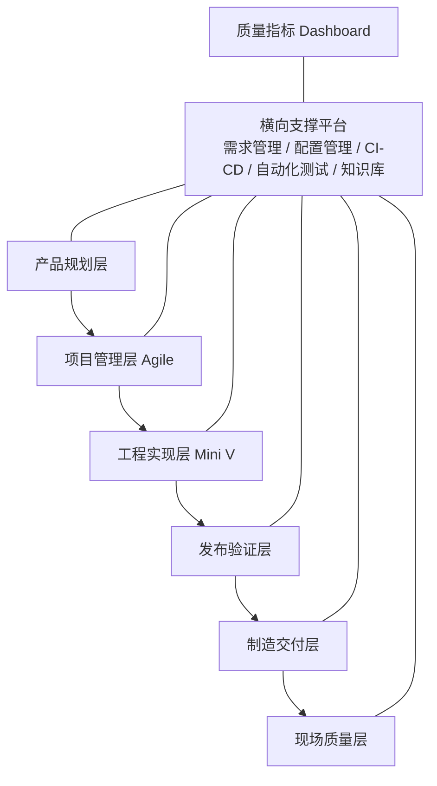
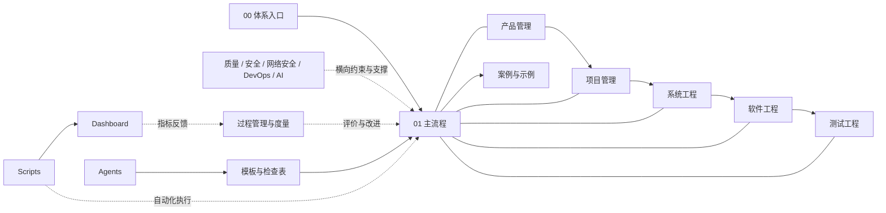

# MEES — Modern Embedded Engineering System

**现代嵌入式研发工程体系**

MEES 是一套可长期维护、可评估、可自动化、可被 AI 使用的现代嵌入式研发工程知识库与企业研发操作框架。

## 核心定位

MEES 将以下方法整合为一个统一工程体系：

- Agile 项目管理
- Mini V 工程开发流程
- DevOps / CI/CD 工程平台
- Automotive SPICE / ISO/IEC 330xx 过程能力
- ISO 26262 功能安全
- IEC 62443 网络安全
- ISO 9001 质量管理
- AI Agent 驱动的质量与知识管理

## 总体架构



## 目录说明

仓库按“文档体系、可复用资产、自动化支撑、编辑与发布环境”四类内容组织。根目录中的主要文件夹作用如下。

| 文件夹 | 当前作用 | 与其他目录的关系 |
| --- | --- | --- |
| `.github/` | 保存 GitHub 自动化工作流，当前用于检查文档构建。 | 读取 `mkdocs.yml` 和 `docs/`，在提交或合并时验证文档站。 |
| `.obsidian/` | 保存 Obsidian 仓库级配置和插件开关。 | 让整个仓库可以作为 Obsidian Vault 使用；工作区和关系图状态属于本地文件，已由 `.gitignore` 排除。 |
| `.agents/` | 预留给开发工具或 Agent 运行时的项目级配置。 | 与 `agents/` 分工：前者面向工具运行配置，后者面向可复用的工程 Agent 资产；当前目录尚未启用正式内容。 |
| `docs/` | MEES 正式知识库和 MkDocs 文档站的内容源。 | 由 `mkdocs.yml` 组织导航，是其他资产的使用说明、过程依据和治理入口。 |
| `templates/` | v0.4 的 18 项工程模板已形成内部基线；两项 `TPL-V05-*` 已进入 v0.5.1 收口候选。 | 模板依据来自 `docs/`；目录和使用说明进入 `docs/13_Templates/`，模拟实例与走查结论进入 `examples/` 和 `docs/15_Case_Study/`。 |
| `checklists/` | 预留可直接执行或被工具读取的工程、质量、安全和发布检查表。 | 检查项依据来自过程文档；面向阅读的检查表发布在 `docs/14_Checklists/`。 |
| `examples/` | 放置本地项目源代码或可公开的最小示例；原始项目可保持独立 Git 历史并由外层仓库忽略。 | 使用 `templates/` 和 `checklists/` 落实 `docs/` 中的过程，过程实例与脱敏结论进入 `docs/15_Case_Study/`。 |
| `scripts/` | 预留链接检查、追溯矩阵生成、指标汇总和发布文档生成脚本。 | 自动处理 `docs/`、`templates/`、`checklists/` 和项目数据，并向 CI 或 `dashboard/` 提供结果。 |
| `dashboard/` | 预留需求覆盖率、测试覆盖率、缺陷趋势、构建状态、风险和过程能力视图。 | 汇总 `scripts/` 生成的指标，用于反馈过程执行效果并推动改进。 |
| `agents/` | 预留可复用的 AI Agent 说明、Prompt、输入输出协议和评审规则。 | Agent 以 `docs/` 为规则来源，调用模板、检查表和脚本辅助评审、测试、度量与知识维护。 |

`.git/` 是 Git 自动维护的版本库元数据，不存放 MEES 业务内容，不应手工修改。

### docs 能力域

`docs/` 采用数字前缀保持阅读和导航顺序。已有内容直接进入 MkDocs 导航；尚未填充的目录表示后续建设边界。

| 文件夹 | 内容作用 | 主要关系 |
| --- | --- | --- |
| `00_Introduction/` | 体系总览、范围、术语和建设路线图。 | 是全库入口，说明各能力域为什么存在以及按什么顺序建设。 |
| `01_Main_Process/` | 项目、需求、架构、验证确认、发布和配置管理的首批主流程。 | 串联各专业域，定义从项目启动到发布交付的最小闭环。 |
| `01_Product_Management/` | 产品规划、需求组合、版本路线和生命周期管理。 | 向项目管理与系统工程提供产品目标和业务优先级。 |
| `02_Project_Management/` | 项目策划、进度、资源、风险、问题和干系人管理。 | 将产品目标转化为执行计划，并协调后续工程域。 |
| `03_System_Engineering/` | 系统需求、系统架构、接口、集成及系统验证。 | 承接产品和项目输入，并向软件、测试及安全域分配技术要求。 |
| `04_Software_Engineering/` | 软件需求、架构、详细设计、实现、单元验证和集成。 | 实现系统分配的软件要求，并向测试工程提供可验证的软件增量。 |
| `05_Test_Engineering/` | 测试策略、计划、设计、执行、报告和缺陷闭环。 | 验证需求与实现，结果反馈给系统、软件、项目和质量管理。 |
| `06_Quality_Engineering/` | 质量策划、过程保证、评审、审核、不符合项和持续改进。 | 横向监督主流程及各专业域的执行质量。 |
| `07_Functional_Safety/` | ISO 26262 相关的安全生命周期、分析、工作产品和确认措施。 | 将功能安全要求嵌入系统、软件、测试、配置和发布活动。 |
| `08_Cybersecurity/` | IEC 62443 等网络安全要求、威胁分析、控制和验证。 | 将网络安全约束嵌入产品、系统、软件、测试及运维流程。 |
| `09_DevOps/` | 版本控制、持续集成、持续交付、环境和制品管理。 | 用工具链承载配置管理、测试、发布和质量门禁。 |
| `10_AI_Engineering/` | AI 辅助工程的使用场景、输入输出协议、评审和治理。 | 为根目录 `agents/` 提供方法约束，并与质量、过程和工具域协同。 |
| `11_Process_Management/` | ASPICE、ISO/IEC 33020 等过程模型解读、映射、评估和改进。 | 为所有过程提供能力评价框架，并向度量域提出评价需求。 |
| `12_Metrics/` | 指标定义、数据口径、采集、分析和报告规则。 | 从各过程和工具链取得数据，为 `dashboard/` 和过程改进提供依据。 |
| `13_Templates/` | 模板的站点版说明、使用规则和轻量 Markdown 模板。 | 解释根目录 `templates/` 中可执行模板应如何使用和维护。 |
| `14_Checklists/` | 各过程的评审与执行检查表，目前已覆盖六个主流程。 | 将主流程和过程模型要求转化为可逐项确认的质量门禁。 |
| `15_Case_Study/` | 端到端案例说明和参考项目复盘。 | 将 `examples/` 中的实例组织为可阅读、可追溯的体系案例。 |
| `16_Agents/` | Agent 能力、使用边界、Prompt 说明和治理文档。 | 解释根目录 `agents/` 中 Agent 资产的设计与使用方法。 |
| `17_Tools/` | 工具链选型、接入、配置和操作说明。 | 解释 `scripts/`、DevOps 平台及外部工程工具如何支撑各过程。 |

### 目录关系



内容流转的基本原则是：产品目标经项目、系统、软件和测试活动形成交付结果；质量、安全、DevOps 和 AI 能力横向支撑主流程；过程管理与度量负责评价结果；模板、检查表、示例、脚本、Agent 和仪表盘将文档规则转化为可执行资产和持续改进反馈。

## 快速开始

1. 使用 Obsidian 打开本目录。
2. 或安装锁定的文档依赖后运行：

```bash
pip install -r requirements-docs.txt
mkdocs serve
```

3. 从 `docs/00_Introduction/00_MEES总览.md` 开始阅读体系总览。
4. 阅读 `docs/00_Introduction/01_建设路线图.md` 了解建设顺序。
5. 阅读 `docs/00_Introduction/06_v0.5自动化与度量建设计划.md` 了解当前工作包、门禁和验收标准。
6. 阅读 `docs/11_Process_Management/ASPICE_ISO_IEC_33020过程映射表.md` 查看 WP1 详细映射和能力差距。
7. 阅读 `docs/11_Process_Management/跨标准控制与证据矩阵.md` 和 `docs/11_Process_Management/v0.3差距与行动项.md` 查看共同控制及 v0.4 输入。
8. 使用 `docs/00_Introduction/02_文档与编号规范.md` 和 `docs/00_Introduction/03_版本规范.md` 维护文档与发布。
9. 阅读 `docs/13_Templates/v0.4模板目录与使用规则.md`，从 `templates/` 选择并复制工程模板。
10. 阅读 `docs/15_Case_Study/MK8_RSIIC_V1_v0.4模板走查.md`，了解 v0.5 自动化输入、模拟实例与产品 `No-Go` 边界。

## 当前版本

- 版本：v0.5.0（内部自动化与方法基线，模拟审计签署）
- 阶段：v0.5.1 状态与证据收口；v0.6 Agent/Obsidian 集成尚未启动
- 状态：v0.5.0 已 V5-G6 `Go`（模拟审计）；当前修订统一模板生命周期、计划/TODO/检查表状态和残留问题处置。证据仍为工具 `P` + 数据 `S`，不构成 MK8/ESS 产品批准、真实独立评估、标准符合性、认证或能力等级证明
- 日期：2026-07-15

## 许可证说明

本工程中的原创内容可按仓库许可证使用。ISO、IEC、VDA、Automotive SPICE 等标准原文及受版权保护材料不包含在本工程中；相关内容仅做原创解读、工程映射和实施指导。
