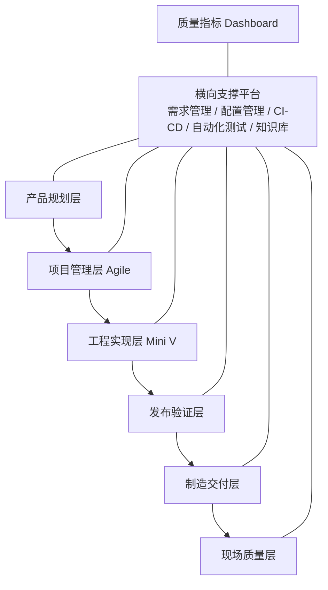

# MEES — Modern Embedded Engineering System

**现代嵌入式研发工程体系**

MEES 是一套可长期维护、可评估、可自动化、可被 AI 使用的现代嵌入式研发工程知识库与企业研发操作框架。

## 核心定位

MEES 将以下方法整合为一个统一工程体系：

- Agile 项目管理
- Mini V 工程开发流程
- DevOps / CI/CD 工程平台
- Automotive SPICE / ISO/IEC 330xx 过程能力
- ISO 26262 功能安全
- IEC 62443 网络安全
- ISO 9001 质量管理
- AI Agent 驱动的质量与知识管理

## 总体架构



## 快速开始

1. 使用 Obsidian 打开本目录。
2. 或安装 MkDocs Material 后运行：

```bash
pip install mkdocs-material
mkdocs serve
```

3. 从 `docs/00_Introduction/00_MEES总览.md` 开始阅读体系总览。
4. 阅读 `docs/00_Introduction/01_建设路线图.md` 了解建设顺序。
5. 从 `docs/13_Templates/文档章节模板.md` 复制新文档模板。

## 当前版本

- 版本：v0.1.0
- 阶段：项目初始化
- 状态：骨架可用，内容持续建设
- 日期：2026-07-13

## 许可证说明

本工程中的原创内容可按仓库许可证使用。ISO、IEC、VDA、Automotive SPICE 等标准原文及受版权保护材料不包含在本工程中；相关内容仅做原创解读、工程映射和实施指导。
