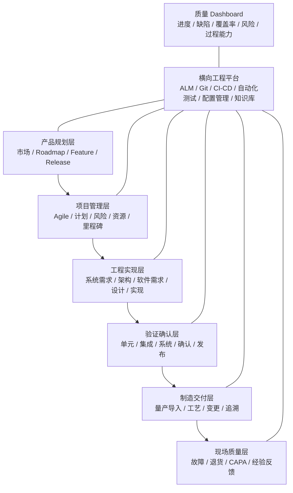

# MEES 总览

## 1. 目的

建立一套覆盖产品规划、项目管理、系统工程、软件工程、测试验证、发布交付、制造与现场质量的现代嵌入式研发体系。

## 2. 体系原则

- 质量前移：缺陷尽量在需求和设计阶段发现。
- 端到端追溯：需求、设计、实现、测试、问题和版本可追溯。
- 风险驱动：项目风险、产品风险、安全风险和网络安全风险统一管理。
- 自动化优先：构建、检查、测试、发布和度量尽量自动化。
- 证据化管理：过程执行必须留下可信、可复核的工程证据。
- 持续改进：以指标、复盘和问题闭环推动体系演进。

## 3. 分层模型

## 4. 标准定位

| 标准或方法 | 在 MEES 中的作用 |
|---|---|
| ISO 9001 | 组织级质量管理框架 |
| ISO/IEC 33020 | 过程能力测量框架 |
| Automotive SPICE | 汽车系统与软件研发过程模型 |
| ISO 26262 | 汽车功能安全生命周期 |
| IEC 62443 | 工业与嵌入式网络安全工程 |
| Agile | 迭代式项目与需求管理 |
| Mini V | 轻量化需求—设计—验证闭环 |
| DevOps | 工程自动化、持续集成与持续交付 |

## 5. 文档状态

- 成熟度：L1 核心过程基线评审中
- 完成度：40%
- 当前门禁：v0.2 Conditional Go，M1–M3 整改待独立复核关闭
- 维护方式：Git + Obsidian + MkDocs
