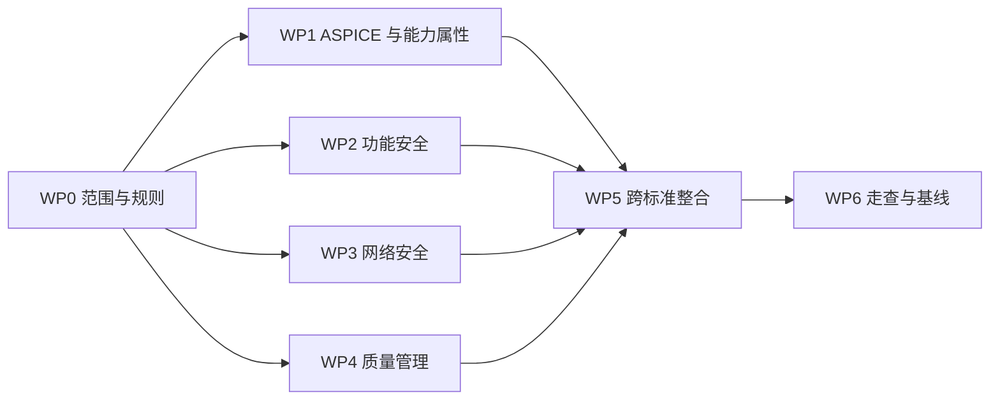

# v0.3.0 标准映射建设计划

> 文档编号：MEES-LIF-002
> 版本：v0.3.0-dev
> 状态：评审中
> 所有者：工程过程负责人
> 最后更新：2026-07-14

## 1. 建设目标

以 `v0.2.0` 核心过程基线为稳定对象，建立 MEES 与 Automotive SPICE、ISO/IEC 33020、ISO 26262、IEC 62443 和 ISO 9001 之间可审查、可追溯、可维护的工程映射，形成从“标准关注点”到“MEES 过程、工作产品、角色、门禁和证据”的双向索引。

v0.3.0 的结果用于识别 CL1 到 CL2 建设差距，并为 v0.4 工程模板确定范围和优先级。它不代表组织、项目或产品已经通过评估、审核或认证。

## 2. 基线与边界

### 输入基线

- Git 标签：`v0.2.0`。
- 核心过程与专业过程：12 篇“已批准”文档。
- 现有映射：[ASPICE + ISO/IEC 33020 过程映射表](../11_Process_Management/ASPICE_ISO_IEC_33020过程映射表.md)。
- 能力模型解读：[ISO/IEC 33020 中文工程解读](../11_Process_Management/ISO_IEC_33020中文工程解读.md)。
- 证据基础：工作产品唯一责任矩阵、G0–G6 门禁、端到端追溯模型和 v0.2 评审问题记录。

### 本阶段范围

1. 明确各标准的适用版本、使用边界、映射粒度和术语口径。
2. 细化 Automotive SPICE 过程与 ISO/IEC 33020 能力属性映射。
3. 建立 ISO 26262 功能安全生命周期接口映射。
4. 建立 IEC 62443 网络安全生命周期接口映射。
5. 建立 ISO 9001 质量管理接口映射。
6. 汇总跨标准共同控制、专有控制、证据复用、差距和行动项。
7. 通过桌面走查、同行评审和自动检查形成 v0.3.0 候选基线。

### 不在范围内

- 标准原文翻译、逐条复制或替代官方标准文本。
- 正式 ASPICE 评估、ISO 审核、认证或能力等级声明。
- 详细硬件开发过程建设；硬件仍按 `EXT-HW` 外部受控对象处理。
- 可直接填写的工作产品模板；模板属于 v0.4。
- 映射自动生成、度量 Dashboard 和 Agent 自动评审；分别属于 v0.5 和 v0.6。

## 3. 映射规则

### 标准来源登记

每个标准在开始详细映射前必须登记名称、版本或版次、适用范围、来源、访问日期、版权限制和维护责任人。版本不明确时不得把映射结论标为“已批准”。

### 映射关系类型

| 类型 | 含义 |
|---|---|
| 直接覆盖 | MEES 过程或工作产品直接承接该标准关注点 |
| 支撑覆盖 | MEES 提供治理、配置、评审、证据或下游接口 |
| 部分覆盖 | 已有内容只覆盖部分目的、结果或证据要求 |
| 不适用 | 经范围和裁剪分析后不适用，并记录理由和批准人 |
| 缺口 | 当前没有充分过程、工作产品、角色或实施证据 |

### 最小映射字段

每一行详细映射至少包含：

- 映射编号和标准引用标识。
- 原创工程解释，不复制标准原文。
- MEES 过程、活动、工作产品、最终责任角色和质量门禁。
- 映射关系类型及理由。
- 最小预期证据和证据状态。
- 适用范围、裁剪条件和相邻过程接口。
- 缺口编号、处置建议、责任角色和目标版本。

映射行编号使用 `MAP-ASP-*`、`MAP-CAP-*`、`MAP-FS-*`、`MAP-CS-*` 和 `MAP-QMS-*`；差距编号使用 `GAP-V03-*`。这些编号用于映射行和问题追踪，不属于正式文档编号。

## 4. 工作包

| 工作包 | 目标 | 主要输出 | 完成判据 |
|---|---|---|---|
| WP0 映射基础 | 冻结标准范围、版本、术语和映射模板 | 标准来源登记、术语表、映射规则、适用性矩阵 | 五类标准均有版本和范围结论，映射字段通过评审 |
| WP1 ASPICE + ISO/IEC 33020 | 从总控映射细化到过程结果、证据和能力属性 | ASPICE 详细映射、PA1.1–PA3.2 证据索引、CL1→CL2 差距 | 11 个核心过程均有映射或不适用理由，能力属性证据可反查 |
| WP2 ISO 26262 | 建立功能安全生命周期与 MEES 的接口 | 安全管理、需求、架构、验证、配置、变更和发布映射 | 适用生命周期活动、角色、工作产品和确认接口均有归属或缺口 |
| WP3 IEC 62443 | 建立网络安全生命周期与 MEES 的接口 | 安全需求、威胁风险、设计、验证、漏洞、补丁和发布映射 | 安全活动可追溯到工程过程、证据和责任角色 |
| WP4 ISO 9001 | 建立质量管理体系与 MEES 的接口 | 顾客要求、策划、运行、绩效评价、不符合和改进映射 | 质量控制点可追溯到过程、门禁、记录和改进行动 |
| WP5 跨标准整合 | 消除重复责任并形成统一差距视图 | 跨标准控制与证据矩阵、差距台账、v0.4 模板输入清单 | 共同控制只保留一个 MEES 责任对象，差距有优先级和目标版本 |
| WP6 验证与基线 | 证明映射结构完整、一致且可复核 | 桌面走查、检查表、评审记录、候选提交和构建证据 | V3-G5 通过，严重和主要问题为 0 |

## 5. 计划交付物

| 交付物 | 计划路径 | 责任角色 |
|---|---|---|
| v0.3 标准映射总览与来源登记 | `docs/11_Process_Management/v0.3标准映射总览.md` | 工程过程负责人 |
| ASPICE + ISO/IEC 33020 详细映射 | 升级现有总映射并按需拆分详细映射 | 工程过程负责人、质量负责人 |
| ISO 26262 过程映射 | `docs/07_Functional_Safety/ISO_26262过程映射.md` | 功能安全负责人 |
| IEC 62443 过程映射 | `docs/08_Cybersecurity/IEC_62443过程映射.md` | 网络安全负责人 |
| ISO 9001 过程映射 | `docs/06_Quality_Engineering/ISO_9001过程映射.md` | 质量负责人 |
| 跨标准控制与证据矩阵 | `docs/11_Process_Management/跨标准控制与证据矩阵.md` | 工程过程负责人 |
| v0.3 差距与行动项 | `docs/11_Process_Management/v0.3差距与行动项.md` | 工程过程负责人、项目经理 |
| v0.3 标准映射基线检查表 | `docs/14_Checklists/v0.3标准映射基线检查表.md` | 质量负责人 |
| v0.3 标准映射桌面走查 | `docs/15_Case_Study/v0.3标准映射桌面走查.md` | 系统、软件、测试和质量负责人 |
| v0.3 基线评审记录 | `docs/11_Process_Management/v0.3基线评审记录.md` | 独立质量评审人 |

## 6. 实施顺序

1. 先完成 WP0，任何详细映射不得绕过版本与范围登记。
2. WP1 建立主映射骨架；WP2、WP3、WP4 可在统一字段冻结后并行开展。
3. WP5 统一责任、证据和差距，形成 v0.4 模板输入优先级。
4. WP6 冻结候选提交，在干净导出目录完成检查并组织人工评审。

## 7. v0.3 质量门禁

| 门禁 | 决策点 | 最小通过条件 | 证据 |
|---|---|---|---|
| V3-G0 范围冻结 | 是否允许开始详细映射 | 五类标准的版本、范围、术语、版权边界和责任人明确 | 标准来源登记、适用性矩阵 |
| V3-G1 核心映射 | ASPICE / 33020 是否可作为主骨架 | 11 个核心过程覆盖完整，PA1.1–PA3.2 证据和差距可反查 | 详细映射、能力属性证据索引 |
| V3-G2 专项映射 | 三个专项标准是否可进入整合 | ISO 26262、IEC 62443、ISO 9001 均完成生命周期接口映射 | 三份专项映射及评审记录 |
| V3-G3 跨标准整合 | 是否消除重复控制和责任冲突 | 共同控制、专有控制、证据复用和差距唯一责任明确 | 跨标准矩阵、差距台账 |
| V3-G4 候选冻结 | 是否进入基线评审 | 导航、链接、编号、映射字段、覆盖和版权检查通过 | 候选提交、自动检查、桌面走查 |
| V3-G5 发布决定 | 是否形成 v0.3.0 Go | 严重和主要问题为 0，其他问题有关闭计划，责任角色完成签署 | 基线检查表、评审记录、Go / No-Go |

V3-G0–V3-G5 是标准映射建设门禁，不替代产品生命周期的 G0–G6。

## 8. v0.3.0 验收标准

- [ ] 所有标准均登记明确版本、来源、适用范围和版权边界。
- [ ] 11 个核心过程均可从标准侧和 MEES 侧双向查询映射关系。
- [ ] 每条映射均包含标准引用、工程解释、MEES 对象、关系类型、证据、责任和差距状态。
- [ ] ASPICE 与 ISO/IEC 33020 映射可支持 PA1.1、PA2.1、PA2.2、PA3.1 和 PA3.2 差距分析。
- [ ] ISO 26262、IEC 62443 和 ISO 9001 的生命周期接口均有唯一 MEES 责任对象或明确缺口。
- [ ] 跨标准矩阵不存在重复最终责任、冲突术语或无法解释的覆盖结论。
- [ ] 至少完成需求变更、缺陷到发布、安全/网络安全变更三条双向桌面走查。
- [ ] 所有差距均有优先级、责任角色、目标版本和关闭判据。
- [ ] 新增文档全部进入 MkDocs 导航，本地链接和严格构建通过。
- [ ] 评审开放严重和主要问题为 0，并形成 v0.3.0 `Go / No-Go` 结论。

## 9. 进入 v0.4 的门禁

只有同时满足以下条件，才允许把 v0.4 工程模板从草稿推进为正式建设基线：

1. V3-G5 通过，v0.3.0 候选提交和评审证据已冻结。
2. 每个拟建模板都能追溯到唯一 MEES 工作产品、责任角色和至少一个标准映射或明确的内部工程需要。
3. 模板优先级已经按合规风险、过程使用频率和证据缺口排序。
4. 工作产品字段、评审准则、配置属性和裁剪规则已经从映射中提取。
5. 开放严重和主要问题为 0；一般问题不影响模板范围和责任边界。
6. 真实评估或认证要求与 MEES 内部工程建议保持清晰区分。

## 10. 角色与评审

| 角色 | v0.3 责任 |
|---|---|
| 工程过程负责人 | 维护总计划、映射规则、跨标准矩阵和候选基线 |
| 系统负责人 | 复核系统需求、架构、接口、集成和确认映射 |
| 软件负责人 | 复核软件需求、架构、实现和单元验证映射 |
| 测试负责人 | 复核集成、测试、验证覆盖和缺陷证据映射 |
| 功能安全负责人 | 对 ISO 26262 工程映射和适用性结论负责 |
| 网络安全负责人 | 对 IEC 62443 工程映射和适用性结论负责 |
| 质量负责人 | 对 ISO 9001 映射、检查表和证据完整性负责 |
| 配置管理员 | 维护标准来源、映射文档、候选提交和基线状态 |
| 独立质量评审人 | 检查映射充分性、诚实边界、问题关闭和发布决定 |

同一维护者可以在建设阶段模拟多个角色，但最终记录必须说明独立性限制，不得把模拟评审表述为真实认证结论。

## 11. 主要风险

| 风险 | 控制措施 |
|---|---|
| 标准版本或适用范围不明确 | V3-G0 前完成来源登记，未冻结版本的映射保持草稿 |
| 把相似概念误判为等价要求 | 使用关系类型和理由，保留部分覆盖及缺口状态 |
| 映射表过大且难以维护 | 总览、专项映射和跨标准矩阵分层，统一编号与字段 |
| 复制标准原文造成版权风险 | 只记录引用标识和原创工程解释，限制直接引用 |
| 文档覆盖被误认为实施能力 | 将文档、模拟证据、项目证据和独立评估证据分栏管理 |
| 过早进入模板或自动化 | 以 V3-G5 和 v0.4 门禁控制范围扩张 |

## 12. 启动清单

- [ ] 建立五类标准来源与版本登记。
- [ ] 冻结映射字段、关系类型、编号和术语表。
- [ ] 将现有 ASPICE / ISO/IEC 33020 总控映射拆解为可逐行复核的详细映射。
- [ ] 创建 ISO 26262、IEC 62443 和 ISO 9001 专项映射骨架。
- [ ] 建立跨标准控制矩阵和 `GAP-V03-*` 台账。
- [ ] 创建 v0.3 检查表、桌面走查和评审记录骨架。

## 13. 版本历史

| 版本 | 日期 | 修改人 | 修改说明 |
|---|---|---|---|
| v0.3.0-dev | 2026-07-14 | JianShi | 建立 v0.3 标准映射目标、工作包、交付物、门禁、验收及 v0.4 准入条件 |
