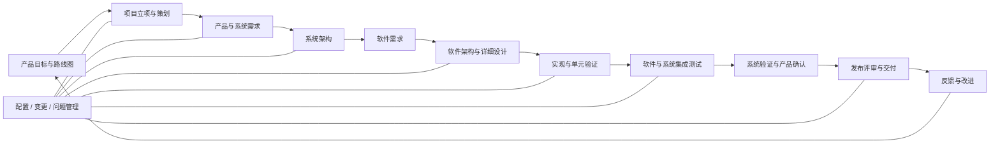

# v0.2 核心过程总览

> 文档编号：MEES-LIF-001
> 版本：v0.2.0
> 状态：已批准（模拟审计）
> 所有者：工程过程负责人
> 最后更新：2026-07-14

## 1. 目的

定义 MEES 从产品目标到正式发布的 Agile + Mini V 最小过程闭环，统一过程边界、输入输出、质量门禁、角色决策、追溯关系和基线控制，为项目裁剪、过程评审及 v0.3 标准映射提供稳定对象。

## 2. 适用范围

适用于嵌入式产品、平台、客户交付、量产变更和维护项目。v0.2 定义组织级最小过程及工作产品要求，不代表任何项目已经实际执行这些过程，也不代表组织达到特定 ASPICE 或 ISO/IEC 33020 能力等级。硬件详细开发过程不在 v0.2 范围内；系统分配到硬件或外部组件时，必须以 `EXT-HW` 受控外部对象及接口证据承接。

## 3. 两层过程架构

| 层级 | 作用 | 过程 |
|---|---|---|
| 总控过程 | 统一项目节奏、跨域规则和横向控制 | [项目管理](01_项目管理过程.md)、[需求管理](02_需求管理过程.md)、[架构设计](03_架构设计过程.md)、[验证确认](04_验证确认过程.md)、[发布管理](05_发布管理过程.md)、[配置管理](06_配置管理过程.md)、[变更与问题管理](07_变更与问题管理过程.md) |
| 专业过程 | 定义产品、系统、软件和测试领域的具体工程活动 | [产品规划](../01_Product_Management/01_产品规划过程.md)、[系统工程](../03_System_Engineering/01_系统工程过程.md)、[软件工程](../04_Software_Engineering/01_软件工程过程.md)、[集成与测试](../05_Test_Engineering/01_集成与测试过程.md) |

总控过程不替代专业过程：总控过程规定共同规则和门禁，专业过程负责产生可审查的工程内容。

## 4. 端到端生命周期

Agile 用于管理产品优先级、迭代计划和反馈节奏；Mini V 用于保证每个需求和设计层级都有对应验证活动。迭代可以循环发生，但不得绕过适用的基线和质量门禁。

## 5. 过程接口矩阵

| 上游过程 | 下游过程 | 关键接口 | 受控证据 |
|---|---|---|---|
| 产品规划 | 项目管理、需求管理 | 产品目标、优先级、候选版本、商业约束 | 产品路线图、产品需求基线、立项决策 |
| 项目管理 | 全部工程过程 | 范围、里程碑、资源、风险、裁剪结果 | 项目计划、风险台账、里程碑记录 |
| 需求管理 | 系统工程、软件工程 | 需求治理规则、来源、跨层状态、追溯和基线批准要求 | 需求治理规则、跨层索引、评审记录、需求基线批准包 |
| 架构设计 | 系统工程、软件工程 | 架构治理准则、跨层决策、追溯和设计基线批准要求 | 架构治理规则、决策台账、评审记录、设计基线批准包 |
| 系统工程 | 软件工程、外部硬件接口 | 软件分配需求、硬件/外部组件分配、系统接口和资源约束 | 系统需求、系统架构、接口说明、外部分配清单 |
| 软件工程 | 集成与测试 | 软件增量、单元验证结果、集成顺序和已知限制 | 软件基线、单元验证报告、交付说明 |
| 集成与测试 | 验证确认 | 分层测试结果、覆盖率、缺陷状态和遗留风险 | 分层测试报告、缺陷清单、G5 证据包 |
| 验证确认 | 发布管理 | 跨层覆盖、G5 结论、遗留风险和发布适宜性 | G5 评审记录、发布验证建议 |
| 配置管理 | 全部过程 | 配置项、基线、版本、状态和审计规则 | 配置项清单、基线记录、配置审计 |
| 变更与问题管理 | 全部过程 | 问题分类、影响分析、变更决策和关闭状态 | 问题记录、变更申请、CCB 决策、关闭证据 |
| 发布管理 | 产品规划、项目管理 | 发布结论、现场反馈、遗留风险和改进输入 | 发布记录、反馈记录、项目复盘 |

## 6. 端到端追溯模型

| 对象 | 标识前缀 | 必须追溯到 |
|---|---|---|
| 产品目标 | `PGO` | 产品需求、版本目标 |
| 产品需求 | `PRD` | 来源、系统需求、确认准则 |
| 系统需求 | `SYS-REQ` | 产品需求、系统架构元素、系统测试 |
| 系统架构元素 | `SYS-ARC` | 系统需求、软件需求或 `EXT-HW` 分配对象、集成测试 |
| 硬件 / 外部组件分配 | `EXT-HW` | 系统架构元素、外部规格/接口、集成测试；硬件详细开发过程不在 v0.2 范围内 |
| 软件需求 | `SWE-REQ` | 系统需求、软件设计元素、软件测试 |
| 软件架构 / 详细设计 | `SWE-ARC` / `SWE-DD` | 软件需求、实现单元、集成或单元验证 |
| 实现单元 | `SWU` | 设计元素、提交或构建、单元验证结果 |
| 测试项 / 用例 | `TST` | 需求或设计对象、执行结果、缺陷 |
| 问题 / 变更 | `PRB` / `CHG` | 受影响对象、决策、实施版本、验证结果 |
| 基线 / 发布 | `BL` / `REL` | 纳入的配置项、变更、测试报告和批准记录 |

追溯必须双向可查询。正式基线中不允许存在没有来源的需求、没有验证方式的需求、没有设计依据的实现项，或无法关联发布版本的测试结果。

## 7. 质量门禁

| 门禁 | 决策点 | 最小准入 | 通过条件 | 决策角色 | 证据 |
|---|---|---|---|---|---|
| G0 产品机会 | 是否进入立项准备 | 需求来源和产品目标已登记 | 价值、范围、风险和候选版本明确 | 产品负责人、管理代表 | 产品机会评审记录 |
| G1 项目启动 | 是否批准项目执行 | 产品目标、初始范围和资源约束可用 | 项目章程、计划、裁剪和风险初版获评审 | 项目经理、产品、工程、质量 | 立项与项目计划评审记录 |
| G2 需求基线 | 是否允许进入架构设计 | 产品及系统需求已分析 | 需求完整、一致、可验证、可追溯且变更受控 | 产品、系统、软件、测试、质量 | 需求基线和评审关闭记录 |
| G3 设计基线 | 是否允许进入完整实现 | 系统与软件架构、关键接口可用 | 需求分配完整，关键风险、接口和验证策略已评审 | 架构、开发、测试、质量 | 架构/设计基线和评审记录 |
| G4 集成准入 | 是否允许进入受控集成 | 实现基线、单元验证和已知问题可用 | 构建成功，单元准出满足，接口和环境就绪 | 开发、测试、配置 | 构建记录、单元报告、准入记录 |
| G5 验证准出 | 是否形成发布候选 | 计划内测试已执行 | 覆盖满足目标，阻塞缺陷清零，遗留风险有结论 | 测试、工程、质量 | 测试报告、缺陷状态、发布建议 |
| G6 发布批准 | 是否正式交付 | 发布候选、测试结论、回退方案完整 | 配置审计通过，交付物可追溯、可复现、可回退 | 项目、工程、测试、配置、质量 | 发布评审、标签和归档清单 |

门禁结论只能是通过、有条件通过或不通过。有条件通过必须记录责任人、截止时间、风险接受人和关闭方式。

## 8. 角色与决策原则

| 角色 | 核心责任 |
|---|---|
| 产品负责人 | 对产品价值、优先级、产品需求和版本目标负责 |
| 项目经理 | 对计划、资源、风险、协调和里程碑负责 |
| 需求工程负责人 | 对需求治理规则、跨层状态、追溯、评审和需求基线批准包负责 |
| 架构治理负责人 | 对架构治理规则、跨层决策、追溯、评审和设计基线批准包负责 |
| 系统负责人 | 对系统需求、系统架构、分配和系统技术完整性负责 |
| 软件负责人 | 对软件需求、设计、实现、集成准备和软件技术完整性负责 |
| 测试负责人 | 对验证策略、覆盖、测试结论和缺陷证据负责 |
| 配置管理员 | 对配置项、基线、版本、状态记录和归档负责 |
| 变更控制负责人 | 对问题/变更流程、CCB 决策状态和关闭记录负责 |
| 发布负责人 | 对发布计划、候选包、发布评审、交付沟通和归档负责 |
| 质量负责人 | 对过程符合性、评审充分性和门禁证据完整性负责 |

本表是负责人角色名称的唯一权威来源。“需求工程负责人”和“架构治理负责人”承担跨层治理，不拥有专业规格内容；“测试负责人”是验证策略、G5 和发布验证建议的唯一领导角色。专业文档可以细化工程师、架构师和集成工程师等执行职责，但不得创造同义负责人名称。

工作产品只能有一个最终责任角色；批准必须包含工作产品提供方和下游使用方，质量负责人监督门禁但不代替技术责任人作技术结论。

### 工作产品唯一责任矩阵

| 工作产品组 | 唯一产出过程 | 最终责任角色 | 其他过程的参与方式 |
|---|---|---|---|
| 产品目标、产品需求、路线图和版本目标 | 产品规划过程 | 产品负责人 | 需求管理治理状态和跨层追溯；配置管理记录正式基线 |
| 需求治理规则、跨层需求索引、追溯矩阵、评审记录和需求基线批准包 | 需求管理过程 | 需求工程负责人 | 专业过程提供规格、分析和状态；配置管理建立正式基线记录 |
| 系统需求规格、系统架构说明、接口控制说明、`EXT-HW` 外部分配及系统追溯 | 系统工程过程 | 系统负责人 | 需求管理和架构设计只治理跨层规则、评审、追溯和基线批准 |
| 软件需求规格、软件架构说明、详细设计、源码、单元验证和软件交付说明 | 软件工程过程 | 软件负责人 | 需求管理和架构设计只治理跨层规则、评审、追溯和基线批准 |
| 架构治理规则、跨层架构决策、追溯矩阵、评审记录和设计基线批准包 | 架构设计过程 | 架构治理负责人 | 系统/软件工程提供专业设计和风险处置；配置管理建立正式基线记录 |
| 分层测试计划、用例、环境、执行、缺陷、报告和 G5 证据包 | 集成与测试过程 | 测试负责人 | 验证确认接收、汇总并评价跨层充分性 |
| 总体验证策略、跨层覆盖、G5 结论和发布验证建议 | 验证确认过程 | 测试负责人 | 专业过程提供受控分层证据，质量负责人监督充分性 |
| 配置项清单、正式基线记录、配置状态报告和配置审计 | 配置管理过程 | 配置管理员 | 各内容所有者提交已批准工作产品和基线批准包 |
| 问题记录、变更申请、CCB 决策及关闭记录 | 变更与问题管理过程 | 变更控制负责人 | 受影响工作产品所有者提供分析、实施和验证证据 |
| 发布计划、候选包、发布说明、发布评审和发布归档 | 发布管理过程 | 发布负责人 | 项目、测试、配置、工程和质量角色提供 G5/G6 输入及批准意见 |

同一角色可以对多个相邻工作产品组最终负责，但同一工作产品不得在两个过程的“输出与工作产品”表中重复声明为本过程产物。治理过程可以维护受控引用、状态和批准包，不因此取得被引用专业内容的最终责任。

## 9. 基线与变更规则

1. G2、G3、G4 和 G6 分别建立需求、设计、实现和发布基线。
2. 基线必须记录范围、版本、建立时间、批准人和用途。
3. 基线后变更统一进入变更与问题管理过程，完成影响分析、批准、实施和验证。
4. 影响安全、网络安全、客户承诺或量产交付的变更必须由对应领域负责人参与决策。
5. 紧急修复可以采用快速路径，但不得省略版本记录、风险接受、验证和发布归档。

## 10. 裁剪规则

- 项目在 G1 前完成裁剪，记录适用过程、合并活动、替代证据和批准人。
- 原型项目可以合并工作产品，但必须保留目标、需求来源、关键设计、验证结论、版本和已知风险。
- 客户交付、量产、安全相关或网络安全相关项目不得裁剪双向追溯、配置基线、缺陷闭环和发布批准。
- 裁剪不改变过程目的，也不能删除法规、合同或组织强制要求。

## 11. v0.2 基线验收

| 验收项 | 工程自检状态 | 说明 |
|---|---|---|
| 产品到发布过程覆盖 | 已满足 | 总控过程和四个专业过程形成完整链路 |
| 输入输出接口闭环 | 已满足 | 本文第 5 节建立统一接口矩阵 |
| 双向追溯模型 | 已满足 | 本文第 6 节定义对象、标识和关系 |
| G0-G6 质量门禁 | 已满足 | 本文第 7 节定义准入、结论、角色和证据 |
| 文档结构和导航检查 | 已满足 | 75 个本地链接及全部自动检查已在 Go 签署版候选提交 `6aab8b0` 的 ZIP 干净导出目录复现 |
| 领域负责人和质量负责人评审 | 已满足 | M1–M4 已关闭，模拟独立审计身份已签署 Go；该签署不代表真实第三方评估或认证 |

## 12. 最小实施证据

- 项目裁剪记录和核心过程清单。
- G0-G6 门禁评审记录及行动项关闭证据。
- 产品、需求、设计、实现和发布基线记录。
- 端到端追溯报告或追溯矩阵。
- 配置状态报告、问题与变更台账、测试报告和发布归档。

## 13. 版本历史

| 版本 | 日期 | 修改人 | 修改说明 |
|---|---|---|---|
| v0.2.0 | 2026-07-14 | JianShi | 建立 v0.2 生命周期、接口、追溯和质量门禁；增加工作产品唯一责任矩阵并关闭 M4 文档缺口 |
