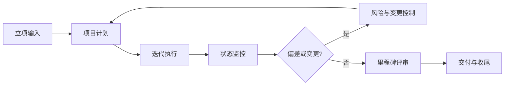

# 项目管理过程

> 文档编号：MEES-PRO-001
> 版本：v0.2.0
> 状态：评审中
> 所有者：项目管理负责人
> 最后更新：2026-07-14

## 1. 目的

定义嵌入式研发项目从立项、计划、执行、监控到收尾的管理方法，确保范围、进度、成本、质量、风险、资源和交付物受控。

## 2. 适用范围

适用于 MEES 覆盖的产品开发、平台开发、客户项目、量产变更项目和维护型项目。小型探索任务可按裁剪规则简化。

## 3. 流程位置

项目管理过程承接[产品规划过程](../01_Product_Management/01_产品规划过程.md)和 G0 决策，在 G1 建立项目计划与裁剪基线，驱动系统、软件、测试和发布活动，并向质量管理和组织度量提供项目状态证据。过程接口和 G0–G6 定义见[核心过程总览](00_核心过程总览.md)。

## 4. 输入

| 输入 | 来源 |
|---|---|
| 产品路线图、商业目标、客户需求 | 产品规划 |
| 项目章程、合同、报价或立项申请 | 管理层 / 客户 |
| 组织过程资产、模板、检查表 | MEES 知识库 |
| 可用资源、关键里程碑、约束条件 | 职能部门 |
| 历史项目度量和经验教训 | 质量与度量平台 |

## 5. 活动

1. 明确项目目标、范围、交付物和成功准则。
2. 建立项目计划，包括阶段、里程碑、资源、预算和沟通机制。
3. 建立风险、问题、依赖和决策台账。
4. 组织迭代计划、周期同步、里程碑评审和项目状态报告。
5. 监控进度、缺陷、风险、需求变更和工程证据完整性。
6. 触发范围、计划、资源或质量目标变更时执行变更控制。
7. 在项目收尾阶段完成交付确认、复盘和经验沉淀。

## 6. 输出与工作产品

| 工作产品 | 最小要求 |
|---|---|
| 项目章程 | 目标、范围、关键干系人、约束和成功准则 |
| 项目计划 | 阶段、里程碑、资源、质量活动和交付物 |
| 风险与问题台账 | 等级、责任人、缓解措施、状态和关闭证据 |
| 迭代计划 / 看板 | 任务拆分、优先级、负责人和完成状态 |
| 项目状态报告 | 进度、质量、风险、变更、阻塞和下一步行动 |
| 项目复盘记录 | 目标达成、问题原因、经验教训和改进项 |

## 7. 角色与职责

| 角色 | 职责 |
|---|---|
| 项目经理 | 组织计划、协调资源、跟踪风险和推动交付 |
| 产品负责人 | 管理业务优先级、范围和发布目标 |
| 系统 / 软件负责人 | 评估工程方案、资源需求和技术风险 |
| 测试负责人 | 规划验证活动、测试资源和质量风险 |
| 质量负责人 | 检查过程执行、证据完整性和质量门禁 |
| 配置管理员 | 维护基线、版本、变更和发布记录 |

## 8. 流程图

## 9. 评审与批准

- 项目章程和项目计划需由项目经理、产品负责人、工程负责人和质量负责人评审。
- 关键里程碑需确认需求、设计、验证、缺陷、风险和配置状态。
- 范围、里程碑、成本或质量目标发生重大变化时需执行变更批准。

## 10. 配置与变更控制

项目计划、里程碑基线、风险台账、发布计划和评审记录应纳入项目配置管理。所有重大变更需记录原因、影响分析、批准人和实施状态。

## 11. 度量指标

| 指标 | 数据来源 |
|---|---|
| 里程碑达成率 | 项目计划 / 评审记录 |
| 需求完成率 | ALM / 需求台账 |
| 缺陷关闭率 | 缺陷管理工具 |
| 风险关闭率 | 风险台账 |
| 构建成功率 | CI/CD 平台 |
| 工程证据完整率 | 质量检查表 |

## 12. 裁剪规则

- 小型内部任务可合并项目章程和项目计划，但必须保留目标、范围、责任人、里程碑和风险记录。
- 高安全、高网络安全或客户交付项目不得裁剪质量门禁、风险管理和配置管理活动。
- 裁剪结果需由项目经理和质量负责人确认。

## 13. 实施证据

- 已批准的项目章程和项目计划。
- 风险、问题、依赖和决策台账。
- 迭代计划、看板记录和状态报告。
- 里程碑评审记录和行动项关闭证据。
- 项目复盘记录。

## 14. 标准映射

| 标准或方法 | 映射说明 |
|---|---|
| Agile | 迭代计划、优先级管理、持续反馈 |
| ASPICE | 项目管理、风险管理、质量保证和配置管理相关过程接口 |
| ISO/IEC 33020 | PA2.1 执行管理、PA2.2 工作产品管理 |
| ISO 9001 | 策划、运行控制、绩效评价和改进 |

## 15. 版本历史

| 版本 | 日期 | 修改人 | 修改说明 |
|---|---|---|---|
| v0.2.0 | 2026-07-14 | JianShi | 明确产品入口、G1 和核心过程接口，进入评审 |
| v0.1.0 | 2026-07-13 | JianShi | 初始版本 |
