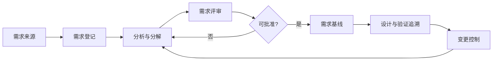

# 需求管理过程

> 文档编号：MEES-PRO-002
> 版本：v0.2.0
> 状态：评审中
> 所有者：需求工程负责人
> 最后更新：2026-07-14

## 1. 目的

定义需求获取、分析、分解、确认、基线、变更和追溯的方法，确保产品需求、系统需求、软件需求和测试验证之间保持一致。

## 2. 适用范围

适用于产品需求、客户需求、法规需求、系统需求、软件需求、安全需求、网络安全需求和生产/服务相关需求。

## 3. 流程位置

需求管理是跨层级总控过程，承接[产品规划过程](../01_Product_Management/01_产品规划过程.md)和项目目标，统一需求属性、状态、基线、变更和追溯规则；系统需求和软件需求的专业分析分别由[系统工程过程](../03_System_Engineering/01_系统工程过程.md)和[软件工程过程](../04_Software_Engineering/01_软件工程过程.md)展开。G2 和端到端追溯规则见[核心过程总览](00_核心过程总览.md)。

## 4. 输入

| 输入 | 来源 |
|---|---|
| 市场需求、客户需求、合同条款 | 产品 / 客户 |
| 法规、标准、安全和网络安全约束 | 合规 / 安全 / 网络安全 |
| 历史问题、现场反馈、竞品分析 | 质量 / 服务 / 产品 |
| 项目范围、发布目标和资源约束 | 项目管理 |

## 5. 活动

1. 收集并登记需求来源，识别需求类型和优先级。
2. 分析需求的清晰性、可行性、可验证性、一致性和完整性。
3. 将高层需求分解为系统需求、软件需求、硬件接口需求和验证需求。
4. 建立需求属性、状态、责任人、版本和双向追溯关系。
5. 组织需求评审，解决歧义、冲突、遗漏和不可验证项。
6. 建立需求基线，并将变更纳入影响分析和批准流程。
7. 持续监控需求覆盖率、变更趋势和验证状态。

## 6. 输出与工作产品

| 工作产品 | 最小要求 |
|---|---|
| 需求清单 | 编号、标题、描述、来源、状态、优先级、责任人 |
| 系统需求规格 | 功能、性能、接口、约束、安全和网络安全要求 |
| 软件需求规格 | 软件功能、诊断、通信、时序、资源和异常处理要求 |
| 需求追溯矩阵 | 上游需求、下游设计、测试用例和缺陷的关联 |
| 需求评审记录 | 问题、结论、行动项和关闭证据 |
| 需求变更记录 | 原因、影响分析、批准和实施状态 |

## 7. 角色与职责

| 角色 | 职责 |
|---|---|
| 产品负责人 | 确认业务目标、优先级和发布范围 |
| 需求工程师 | 组织需求分析、分解、评审和追溯 |
| 系统工程师 | 建立系统需求和系统级约束 |
| 软件工程师 | 分解软件需求并确认实现可行性 |
| 测试工程师 | 确认需求可验证性并建立验证覆盖 |
| 质量负责人 | 检查需求基线、评审和变更证据 |

## 8. 流程图

## 9. 评审与批准

- 每条正式需求必须通过可理解、可实现、可验证和可追溯检查。
- 需求基线需由产品、系统、软件、测试和质量代表共同批准。
- 安全和网络安全相关需求需由对应领域负责人参与评审。

## 10. 配置与变更控制

需求基线、评审记录、追溯矩阵和变更记录应纳入配置管理。需求变更必须包含影响范围、受影响工作产品、验证影响和批准结论。

## 11. 度量指标

| 指标 | 数据来源 |
|---|---|
| 需求评审通过率 | 需求评审记录 |
| 需求变更率 | 需求变更记录 |
| 需求覆盖率 | 追溯矩阵 |
| 未关闭需求问题数 | 评审问题台账 |
| 需求验证完成率 | 测试管理工具 |

## 12. 裁剪规则

- 概念验证项目可简化需求规格，但必须保留需求来源、验收准则和变更记录。
- 客户交付、安全相关或量产项目不得裁剪需求追溯和基线管理。

## 13. 实施证据

- 需求清单和需求规格。
- 需求评审记录和问题关闭证据。
- 需求基线记录。
- 需求追溯矩阵。
- 需求变更影响分析和批准记录。

## 14. 标准映射

| 标准或方法 | 映射说明 |
|---|---|
| ASPICE | 系统需求分析、软件需求分析、变更管理和追溯 |
| ISO/IEC 33020 | PA1.1 过程执行、PA2.2 工作产品管理 |
| ISO 26262 | 安全需求分解、追溯和确认接口 |
| IEC 62443 | 网络安全需求识别和追溯接口 |

## 15. 版本历史

| 版本 | 日期 | 修改人 | 修改说明 |
|---|---|---|---|
| v0.2.0 | 2026-07-14 | JianShi | 明确跨层需求治理、专业过程接口和 G2，进入评审 |
| v0.1.0 | 2026-07-13 | JianShi | 初始版本 |
