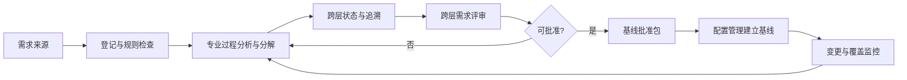

# 需求管理过程

> 文档编号：MEES-PRO-002
> 版本：v0.2.0
> 状态：已批准（模拟审计）
> 所有者：需求工程负责人
> 最后更新：2026-07-14

## 1. 目的

定义跨层需求治理、状态控制、评审、基线批准和追溯方法，确保产品、系统、软件及验证对象之间保持一致，并明确专业规格的唯一内容责任。

## 2. 适用范围

适用于产品、客户、法规、系统、软件、安全、网络安全及生产/服务相关需求的跨层治理。系统需求和软件需求的专业分析及规格编制不由本过程执行。

## 3. 流程位置

需求管理是跨层级总控过程，承接[产品规划过程](../01_Product_Management/01_产品规划过程.md)和项目目标，统一需求属性、状态、基线批准、变更和追溯规则。[系统工程过程](../03_System_Engineering/01_系统工程过程.md)唯一负责系统需求规格，[软件工程过程](../04_Software_Engineering/01_软件工程过程.md)唯一负责软件需求规格；本过程只治理这些规格的状态、关系、评审和基线接口。G2、工作产品唯一责任和端到端追溯规则见[核心过程总览](00_核心过程总览.md)。

## 4. 输入

| 输入 | 来源 |
|---|---|
| 市场需求、客户需求、合同条款 | 产品 / 客户 |
| 法规、标准、安全和网络安全约束 | 合规 / 安全 / 网络安全 |
| 历史问题、现场反馈、竞品分析 | 质量 / 服务 / 产品 |
| 项目范围、发布目标和资源约束 | 项目管理 |

## 5. 活动

1. 建立需求标识、属性、状态、责任、评审、基线和追溯规则。
2. 接收并登记产品需求及其他来源，检查来源、类型、优先级和验收准则完整性。
3. 协调系统工程和软件工程开展专业需求分析与分解：系统工程产出系统需求及 `EXT-HW` 外部分配，软件工程产出软件需求，本过程不编制或批准其技术内容。
4. 维护跨层需求索引、状态、版本、责任人和双向追溯关系。
5. 组织跨层需求评审，汇总并跟踪歧义、冲突、遗漏、不可验证项和接口问题。
6. 准备需求基线批准包，协调配置管理建立正式基线记录，并将后续变更纳入影响分析和批准流程。
7. 持续监控需求覆盖率、状态、变更趋势和验证完成情况。

## 6. 输出与工作产品

| 工作产品 | 最小要求 |
|---|---|
| 需求治理规则 | 标识、属性、状态、责任、评审、基线和追溯约定 |
| 跨层需求索引与状态报告 | 受控规格引用、版本、所有者、状态、基线归属和异常项 |
| 端到端需求追溯矩阵 | 产品、系统、软件、设计、测试、缺陷和发布对象的关联 |
| 跨层需求评审记录 | 参与角色、问题、结论、行动项和关闭证据 |
| 需求基线批准包 | 候选范围、受控版本、评审结论、开放项、批准人和配置基线请求 |
| 需求变更影响台账 | 原因、受影响对象、专业分析引用、批准和实施状态 |

系统需求规格、软件需求规格及 `EXT-HW` 外部分配不是本过程的输出；本过程仅引用、统筹和治理这些专业工作产品。

## 7. 角色与职责

| 角色 | 职责 |
|---|---|
| 产品负责人 | 确认业务目标、优先级和发布范围 |
| 需求工程负责人 | 对需求治理规则、跨层状态、追溯、评审和基线批准包最终负责 |
| 系统负责人 | 对系统需求规格及 `EXT-HW` 外部分配最终负责 |
| 软件负责人 | 对软件需求规格最终负责 |
| 测试工程师 | 确认需求可验证性并建立验证覆盖 |
| 质量负责人 | 检查需求基线、评审和变更证据 |

## 8. 流程图

## 9. 评审与批准

- 每条正式需求必须由其专业所有者完成可理解、可实现、可验证和可追溯检查。
- 需求工程负责人组织 G2 跨层评审并形成基线批准包；产品、系统、软件、测试和质量代表共同批准适用范围。
- 安全和网络安全相关需求需由对应领域负责人参与评审。

## 10. 配置与变更控制

需求治理规则、跨层索引、评审记录、追溯矩阵、基线批准包和变更影响台账应纳入配置管理。配置管理员唯一负责正式需求基线记录；专业规格内容变更由其工作产品所有者分析，本过程汇总跨层影响和批准状态。

## 11. 度量指标

| 指标 | 数据来源 |
|---|---|
| 需求评审通过率 | 需求评审记录 |
| 需求变更率 | 需求变更记录 |
| 需求覆盖率 | 追溯矩阵 |
| 未关闭需求问题数 | 评审问题台账 |
| 需求验证完成率 | 测试管理工具 |

## 12. 裁剪规则

- 概念验证项目可由专业过程简化需求规格，但本过程仍须保留来源、验收准则、所有者、状态、追溯和变更记录。
- 客户交付、安全相关或量产项目不得裁剪需求追溯和基线管理。

## 13. 实施证据

- 需求治理规则及跨层需求索引与状态报告。
- 需求评审记录和问题关闭证据。
- 需求基线批准包及配置管理建立的基线记录引用。
- 端到端需求追溯矩阵。
- 需求变更影响分析和批准记录。

## 14. 标准映射

| 标准或方法 | 映射说明 |
|---|---|
| ASPICE | 统筹 SYS.2、SWE.1 的跨层治理、评审、状态和追溯接口；专业分析与规格输出由系统工程和软件工程承担 |
| ISO/IEC 33020 | PA1.1 过程执行、PA2.2 工作产品管理 |
| ISO 26262 | 安全需求分解、追溯和确认接口 |
| IEC 62443 | 网络安全需求识别和追溯接口 |

## 15. 版本历史

| 版本 | 日期 | 修改人 | 修改说明 |
|---|---|---|---|
| v0.2.0 | 2026-07-14 | JianShi | 明确跨层治理、专业过程接口和 G2；按 M4 移除系统/软件规格双重所有权并统一 `EXT-HW` 接口 |
| v0.1.0 | 2026-07-13 | JianShi | 初始版本 |
