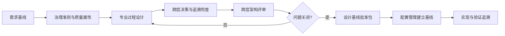

# 架构设计过程

> 文档编号：MEES-PRO-003
> 版本：v0.2.0
> 状态：已批准
> 所有者：架构治理负责人
> 最后更新：2026-07-14

## 1. 目的

定义跨层架构治理、质量准则、技术决策、评审、基线批准和追溯方法，确保系统与软件架构保持一致，并明确专业架构工作产品的唯一内容责任。

## 2. 适用范围

适用于系统架构、软件架构、关键接口、诊断通信、运行时行为、资源分配、安全机制、网络安全机制和架构决策的跨层治理。系统与软件架构的专业设计和规格编制不由本过程执行。

## 3. 流程位置

架构设计是系统与软件层的总控治理过程，承接 G2 需求基线并统筹 G3 设计基线批准。[系统工程过程](../03_System_Engineering/01_系统工程过程.md)唯一负责系统架构说明和接口控制说明，[软件工程过程](../04_Software_Engineering/01_软件工程过程.md)唯一负责软件架构说明和详细设计；本过程只治理跨层准则、决策、追溯、评审和基线接口。统一门禁及工作产品唯一责任见[核心过程总览](00_核心过程总览.md)。

## 4. 输入

| 输入 | 来源 |
|---|---|
| 系统需求、软件需求和约束 | 需求管理 |
| 安全、网络安全、性能和诊断要求 | 领域工程 |
| 平台约束、硬件接口、复用资产 | 平台 / 硬件 / 软件团队 |
| 历史缺陷、现场问题和技术债 | 质量 / 维护团队 |

## 5. 活动

1. 建立跨层架构治理规则、质量属性、评审准则、决策状态和追溯约定。
2. 协调系统工程和软件工程分别完成系统架构、系统接口、软件架构及详细设计，本过程不编制或批准其专业技术内容。
3. 维护跨层关键架构决策台账，记录问题、备选方案、专业所有者意见、影响、风险和状态。
4. 检查系统需求、系统元素、`EXT-HW` 外部分配、软件需求、软件组件和验证对象之间的一致性。
5. 汇总安全、网络安全、性能、资源、接口和可测试性等跨层风险及专业处置引用。
6. 组织跨层架构评审，跟踪接口冲突、责任边界、技术风险和不可验证设计问题。
7. 准备设计基线批准包，协调配置管理建立正式基线记录，并持续维护跨层追溯。

## 6. 输出与工作产品

| 工作产品 | 最小要求 |
|---|---|
| 架构治理规则与质量准则 | 质量属性、评审准则、决策状态、追溯和基线约定 |
| 跨层架构决策台账 | 问题、备选方案、专业意见、决策、影响、风险和状态 |
| 跨层架构追溯矩阵 | 需求、系统元素、`EXT-HW`、软件元素、测试项和风险的关联 |
| 跨层架构评审记录 | 参与角色、评审问题、结论、行动项和关闭证据 |
| 设计基线批准包 | 候选范围、受控版本、专业评审结论、开放项、批准人和配置基线请求 |
| 技术风险与接口问题台账 | 责任方、影响层级、处置引用、状态和关闭证据 |

系统架构说明、接口控制说明、软件架构说明和软件详细设计不是本过程的输出；本过程仅引用、统筹和治理这些专业工作产品。

## 7. 角色与职责

| 角色 | 职责 |
|---|---|
| 架构治理负责人 | 对架构治理规则、跨层决策、追溯、评审和设计基线批准包最终负责 |
| 系统负责人 | 对系统架构说明和接口控制说明最终负责 |
| 软件负责人 | 对软件架构说明和软件详细设计最终负责 |
| 安全工程师 | 确认安全机制和安全需求分配 |
| 网络安全工程师 | 确认网络安全机制和威胁缓解措施 |
| 开发工程师 | 评估实现可行性、复杂度和技术风险 |
| 测试工程师 | 确认架构可验证性和集成测试策略 |
| 质量负责人 | 检查架构基线、评审和追溯证据 |

## 8. 流程图

## 9. 评审与批准

- 专业架构内容由系统负责人或软件负责人组织技术评审；跨层架构评审覆盖需求分配、接口一致性、关键风险、可测试性和标准约束。
- 架构治理负责人形成跨层决策和 G3 设计基线批准包，系统、软件、测试和质量负责人确认适用范围。
- 安全和网络安全机制需由对应领域负责人批准。

## 10. 配置与变更控制

架构治理规则、跨层决策、追溯矩阵、评审记录、设计基线批准包和风险问题台账应纳入配置管理。配置管理员唯一负责正式设计基线记录；专业架构内容变更由其工作产品所有者分析，本过程汇总跨层影响和批准状态。

## 11. 度量指标

| 指标 | 数据来源 |
|---|---|
| 需求架构覆盖率 | 架构追溯矩阵 |
| 架构评审问题关闭率 | 评审记录 |
| 接口变更次数 | 接口控制说明 / 变更记录 |
| 关键风险关闭率 | 技术风险台账 |
| 架构决策完成率 | 架构决策记录 |

## 12. 裁剪规则

- 小型软件变更可使用简化架构说明，但必须记录受影响组件、接口、风险和验证影响。
- 平台级、安全相关或跨团队接口变更不得裁剪架构评审和接口基线。

## 13. 实施证据

- 架构治理规则与质量准则。
- 跨层架构决策台账和专业架构工作产品受控引用。
- 跨层架构评审记录和问题关闭证据。
- 设计基线批准包及配置管理建立的基线记录引用。
- 跨层架构追溯、技术风险和接口问题关闭证据。

## 14. 标准映射

| 标准或方法 | 映射说明 |
|---|---|
| ASPICE | 统筹 SYS.3、SWE.2 的跨层治理、决策、评审和追溯接口；专业架构输出由系统工程和软件工程承担 |
| ISO/IEC 33020 | PA1.1 过程执行、PA2.2 工作产品管理、PA3.1 过程定义 |
| ISO 26262 | 技术安全概念、系统设计、软件架构安全机制接口 |
| IEC 62443 | 安全分区、通信通道和安全机制设计接口 |

## 15. 版本历史

| 版本 | 日期 | 修改人 | 修改说明 |
|---|---|---|---|
| v0.2.0 | 2026-07-14 | JianShi | 明确专业过程边界和 G3；按 M4 移除系统/软件架构及接口说明双重所有权 |
| v0.1.0 | 2026-07-13 | JianShi | 初始版本 |
