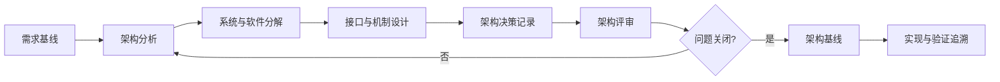

# 架构设计过程

> 文档编号：MEES-PRO-003  
> 版本：v0.1.0  
> 状态：草稿  
> 所有者：系统与软件架构负责人  
> 最后更新：2026-07-13

## 1. 目的

定义系统架构和软件架构的设计、评审、基线和追溯方法，确保需求被合理分配到组件、接口、运行机制和验证策略中。

## 2. 适用范围

适用于系统架构、软件架构、关键接口、诊断通信、运行时行为、资源分配、安全机制、网络安全机制和架构决策。

## 3. 流程位置

架构设计过程承接已基线化的需求，向详细设计、实现、集成测试、系统测试和发布评审提供设计依据。

## 4. 输入

| 输入 | 来源 |
|---|---|
| 系统需求、软件需求和约束 | 需求管理 |
| 安全、网络安全、性能和诊断要求 | 领域工程 |
| 平台约束、硬件接口、复用资产 | 平台 / 硬件 / 软件团队 |
| 历史缺陷、现场问题和技术债 | 质量 / 维护团队 |

## 5. 活动

1. 分析需求并识别关键质量属性、约束和风险。
2. 定义系统分解、软件组件、接口、数据流和控制流。
3. 形成关键架构决策，记录备选方案、理由、影响和风险。
4. 将需求分配到系统元素、软件组件和验证对象。
5. 识别安全、网络安全、性能、资源和可测试性设计措施。
6. 组织架构评审，关闭接口冲突、职责不清和不可验证设计问题。
7. 建立架构基线，并维护与需求、实现、测试之间的追溯。

## 6. 输出与工作产品

| 工作产品 | 最小要求 |
|---|---|
| 系统架构说明 | 系统分解、接口、数据流、状态和约束 |
| 软件架构说明 | 软件组件、职责、接口、依赖、运行机制 |
| 接口控制说明 | 信号、协议、时序、错误处理和兼容性要求 |
| 架构决策记录 | 问题、备选方案、决策、影响和状态 |
| 架构追溯矩阵 | 需求到架构元素、测试项和风险的关联 |
| 架构评审记录 | 评审问题、结论、行动项和关闭证据 |

## 7. 角色与职责

| 角色 | 职责 |
|---|---|
| 系统架构师 | 建立系统分解、接口和系统级设计约束 |
| 软件架构师 | 建立软件组件、运行机制和技术决策 |
| 安全工程师 | 确认安全机制和安全需求分配 |
| 网络安全工程师 | 确认网络安全机制和威胁缓解措施 |
| 开发工程师 | 评估实现可行性、复杂度和技术风险 |
| 测试工程师 | 确认架构可验证性和集成测试策略 |
| 质量负责人 | 检查架构基线、评审和追溯证据 |

## 8. 流程图

## 9. 评审与批准

- 架构评审应覆盖需求分配、接口一致性、关键风险、可测试性和标准约束。
- 关键架构决策需由架构负责人、开发负责人、测试负责人和质量负责人确认。
- 安全和网络安全机制需由对应领域负责人批准。

## 10. 配置与变更控制

架构说明、接口说明、架构决策记录和追溯矩阵应纳入配置管理。架构变更需分析对需求、实现、测试、发布和已知风险的影响。

## 11. 度量指标

| 指标 | 数据来源 |
|---|---|
| 需求架构覆盖率 | 架构追溯矩阵 |
| 架构评审问题关闭率 | 评审记录 |
| 接口变更次数 | 接口控制说明 / 变更记录 |
| 关键风险关闭率 | 技术风险台账 |
| 架构决策完成率 | 架构决策记录 |

## 12. 裁剪规则

- 小型软件变更可使用简化架构说明，但必须记录受影响组件、接口、风险和验证影响。
- 平台级、安全相关或跨团队接口变更不得裁剪架构评审和接口基线。

## 13. 实施证据

- 系统架构说明和软件架构说明。
- 接口控制说明和架构决策记录。
- 架构评审记录和问题关闭证据。
- 需求到架构、实现和测试的追溯记录。
- 技术风险分析和缓解证据。

## 14. 标准映射

| 标准或方法 | 映射说明 |
|---|---|
| ASPICE | 系统架构设计、软件架构设计、集成策略接口 |
| ISO/IEC 33020 | PA1.1 过程执行、PA2.2 工作产品管理、PA3.1 过程定义 |
| ISO 26262 | 技术安全概念、系统设计、软件架构安全机制接口 |
| IEC 62443 | 安全分区、通信通道和安全机制设计接口 |

## 15. 版本历史

| 版本 | 日期 | 修改人 | 修改说明 |
|---|---|---|---|
| v0.1.0 | 2026-07-13 | JianShi | 初始版本 |
