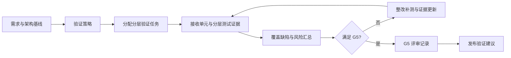

# 验证确认过程

> 文档编号：MEES-PRO-004
> 版本：v0.2.0
> 状态：已批准
> 所有者：测试负责人
> 最后更新：2026-07-14

## 1. 目的

定义跨层验证策略、验证任务分配、证据汇总、覆盖与风险分析以及 G5 结论形成的方法，证明产品满足需求、设计意图和发布准则。

## 2. 适用范围

适用于对单元验证、软件集成测试、系统集成测试、软件测试、系统测试、确认测试、回归测试和自动化测试的统筹及证据汇总。本过程不直接执行单元、集成或系统测试：单元验证由软件工程过程负责，其他分层测试由集成与测试过程负责。

## 3. 流程位置

验证确认是分层验证的总控过程，承接需求、设计和实现基线，拥有总体验证策略、跨层覆盖汇总、G5 结论和发布验证建议的最终责任。[软件工程过程](../04_Software_Engineering/01_软件工程过程.md)负责单元验证，[集成与测试过程](../05_Test_Engineering/01_集成与测试过程.md)负责分层测试执行及证据包；G4/G5 见[核心过程总览](00_核心过程总览.md)。

## 4. 输入

| 输入 | 来源 |
|---|---|
| 需求基线和验收准则 | 需求管理 |
| 架构设计、接口说明和风险清单 | 架构设计 |
| 单元验证结果和软件增量说明 | 软件工程 |
| 分层测试计划、报告和 G5 证据包 | 集成与测试 |
| 发布计划、配置基线和构建包 | 项目管理 / 配置管理 |
| 历史缺陷、现场问题和回归范围 | 质量 / 维护团队 |

## 5. 活动

1. 建立总体验证策略，定义验证层级、目标、独立性、资源、环境原则和准入准出条件。
2. 将单元、集成、软件、系统和确认测试任务分配到软件工程及集成与测试过程。
3. 建立跨层覆盖模型，确认每条需求和关键设计对象都有适用验证出口。
4. 接收并审查单元验证结果和分层测试证据包，不重复创建其测试用例或执行记录。
5. 汇总需求覆盖、测试结论、缺陷状态、偏差、豁免和遗留风险。
6. 组织 G5 评审，确认阻塞问题、配置状态和风险接受条件。
7. 形成跨层验证总结和唯一的发布验证建议。

## 6. 输出与工作产品

| 工作产品 | 最小要求 |
|---|---|
| 总体验证策略 / 主计划 | 层级、目标、任务分配、独立性、资源和总准入准出规则 |
| 跨层验证追溯与覆盖汇总 | 需求、设计对象、分层验证证据、缺口和豁免关系 |
| 分层验证证据索引 | 单元、集成、软件、系统和确认测试报告的受控引用 |
| 缺陷与遗留风险汇总 | 跨层缺陷状态、偏差、豁免、风险接受和阻塞项 |
| G5 评审记录 | 证据审查、门禁结论、条件、责任人和批准角色 |
| 发布验证建议 | 跨层验证总结、发布适宜性、遗留风险和限制；由测试负责人最终负责 |

## 7. 角色与职责

| 角色 | 职责 |
|---|---|
| 测试负责人 | 对总体验证策略、跨层覆盖、G5 结论和发布验证建议最终负责 |
| 测试工程师 | 提供分层测试证据并支持覆盖和风险汇总 |
| 开发工程师 | 支持缺陷分析、修复和单元验证 |
| 系统 / 软件负责人 | 确认技术风险和验证充分性 |
| 配置管理员 | 提供受控构建、版本和测试配置 |
| 质量负责人 | 检查测试证据、缺陷闭环和发布准则 |

## 8. 流程图

## 9. 评审与批准

- 总体验证策略需由测试负责人、项目经理、系统/软件负责人和质量负责人评审。
- 分层测试规格与执行证据由相应专业过程评审，验证确认过程检查其覆盖完整性和受控引用。
- G5 记录和发布验证建议由测试负责人最终负责，并由工程和质量负责人共同确认。

## 10. 配置与变更控制

总体验证策略、覆盖汇总、证据索引、G5 记录和发布验证建议应纳入配置管理。分层用例、脚本、环境、数据、执行记录和报告由产生它们的专业过程配置管理；需求或架构变更后需执行跨层验证影响分析。

## 11. 度量指标

| 指标 | 数据来源 |
|---|---|
| 跨层需求验证覆盖率 | 追溯矩阵 / 证据索引 |
| 分层证据接收完成率 | 分层验证证据索引 |
| G5 行动项关闭率 | G5 评审记录 |
| 遗留风险批准率 | 风险汇总 / 批准记录 |
| 发布阻塞缺陷数 | 缺陷管理工具 |

## 12. 裁剪规则

- 探索性原型可简化跨层验证总结，但必须保留关键验收结果、证据引用和已知风险。
- 客户交付、安全相关、网络安全相关或量产发布不得裁剪需求覆盖、缺陷闭环和发布验证结论。

## 13. 实施证据

- 总体验证策略、任务分配和总准入准出准则。
- 单元及分层测试证据索引。
- 跨层覆盖、缺陷、偏差和遗留风险汇总。
- G5 评审记录和发布验证建议。

## 14. 标准映射

| 标准或方法 | 映射说明 |
|---|---|
| ASPICE | 统筹 SWE.4、SWE.5、SWE.6、SYS.4、SYS.5 的证据接口；具体执行映射由软件工程及集成与测试过程承担 |
| ISO/IEC 33020 | PA1.1 过程执行、PA2.1 执行管理、PA2.2 工作产品管理 |
| ISO 26262 | 安全验证、确认措施和测试证据接口 |
| IEC 62443 | 网络安全验证、漏洞验证和安全测试接口 |

## 15. 版本历史

| 版本 | 日期 | 修改人 | 修改说明 |
|---|---|---|---|
| v0.2.0 | 2026-07-14 | JianShi | 明确总控职责、唯一工作产品责任、G4/G5 和专业过程接口，进入评审 |
| v0.1.0 | 2026-07-13 | JianShi | 初始版本 |
