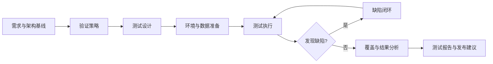

# 验证确认过程

> 文档编号：MEES-PRO-004  
> 版本：v0.1.0  
> 状态：草稿  
> 所有者：测试与验证负责人  
> 最后更新：2026-07-13

## 1. 目的

定义从测试策略、测试设计、测试执行、缺陷闭环到确认结论的过程，证明产品满足需求、设计意图和发布准则。

## 2. 适用范围

适用于单元验证、软件集成测试、系统集成测试、系统测试、确认测试、回归测试、自动化测试和发布前验证。

## 3. 流程位置

验证确认过程承接需求和架构基线，向发布管理提供测试结果、缺陷状态、风险结论和发布建议。

## 4. 输入

| 输入 | 来源 |
|---|---|
| 需求基线和验收准则 | 需求管理 |
| 架构设计、接口说明和风险清单 | 架构设计 |
| 发布计划、配置基线和构建包 | 项目管理 / 配置管理 |
| 历史缺陷、现场问题和回归范围 | 质量 / 维护团队 |

## 5. 活动

1. 建立验证策略，定义测试层级、范围、环境、工具和准入准出条件。
2. 从需求、架构、风险和历史问题导出测试项和测试用例。
3. 准备测试环境、测试数据、自动化脚本和测试配置。
4. 执行测试并记录结果、日志、版本、环境和偏差。
5. 登记缺陷，推动分析、修复、验证和关闭。
6. 维护需求、测试用例、测试结果和缺陷之间的追溯。
7. 形成验证总结和发布建议。

## 6. 输出与工作产品

| 工作产品 | 最小要求 |
|---|---|
| 验证策略 / 测试计划 | 范围、层级、环境、准入准出、资源和进度 |
| 测试用例 | 前置条件、步骤、输入、预期结果和追溯关系 |
| 测试执行记录 | 版本、环境、结果、日志、偏差和执行人 |
| 缺陷记录 | 严重度、复现步骤、影响、责任人和关闭证据 |
| 测试报告 | 覆盖率、通过率、缺陷状态、风险和结论 |
| 发布验证建议 | 是否满足发布准则及遗留风险说明 |

## 7. 角色与职责

| 角色 | 职责 |
|---|---|
| 测试负责人 | 建立验证策略、资源计划和测试报告 |
| 测试工程师 | 设计、执行和维护测试用例 |
| 开发工程师 | 支持缺陷分析、修复和单元验证 |
| 系统 / 软件负责人 | 确认技术风险和验证充分性 |
| 配置管理员 | 提供受控构建、版本和测试配置 |
| 质量负责人 | 检查测试证据、缺陷闭环和发布准则 |

## 8. 流程图

## 9. 评审与批准

- 测试计划需由测试负责人、项目经理、工程负责人和质量负责人评审。
- 测试用例需覆盖需求、接口、异常、边界、回归和风险场景。
- 发布前测试报告需由测试负责人和质量负责人确认。

## 10. 配置与变更控制

测试计划、用例、脚本、测试环境配置、测试数据、执行记录和测试报告应纳入配置管理。需求或架构变更后需执行测试影响分析。

## 11. 度量指标

| 指标 | 数据来源 |
|---|---|
| 需求测试覆盖率 | 追溯矩阵 / 测试管理工具 |
| 测试通过率 | 测试执行记录 |
| 缺陷发现与关闭趋势 | 缺陷管理工具 |
| 自动化测试占比 | 自动化平台 |
| 回归测试完成率 | 测试计划 / 执行记录 |
| 发布阻塞缺陷数 | 缺陷管理工具 |

## 12. 裁剪规则

- 探索性原型可简化测试报告，但必须保留关键验收结果和已知风险。
- 客户交付、安全相关、网络安全相关或量产发布不得裁剪需求覆盖、缺陷闭环和发布验证结论。

## 13. 实施证据

- 验证策略、测试计划和准入准出准则。
- 测试用例、自动化脚本和执行记录。
- 缺陷记录、分析结论和关闭证据。
- 覆盖率报告、测试报告和发布验证建议。

## 14. 标准映射

| 标准或方法 | 映射说明 |
|---|---|
| ASPICE | 软件单元验证、软件集成验证、系统集成验证、系统测试接口 |
| ISO/IEC 33020 | PA1.1 过程执行、PA2.1 执行管理、PA2.2 工作产品管理 |
| ISO 26262 | 安全验证、确认措施和测试证据接口 |
| IEC 62443 | 网络安全验证、漏洞验证和安全测试接口 |

## 15. 版本历史

| 版本 | 日期 | 修改人 | 修改说明 |
|---|---|---|---|
| v0.1.0 | 2026-07-13 | JianShi | 初始版本 |
