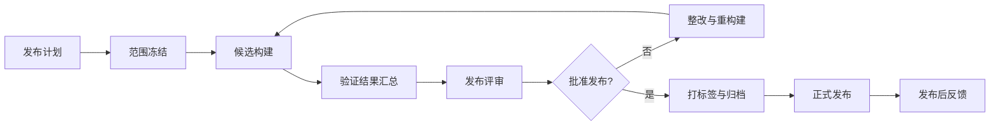

# 发布管理过程

> 文档编号：MEES-PRO-005
> 版本：v0.2.0
> 状态：评审中
> 所有者：发布与配置负责人
> 最后更新：2026-07-14

## 1. 目的

定义软件、固件、文档、配置和交付证据从候选版本到正式发布的控制方法，确保发布内容可识别、可追溯、可复现、可回退。

## 2. 适用范围

适用于内部版本、客户交付版本、量产版本、维护版本、紧急修复版本和配套文档发布。

## 3. 流程位置

发布管理过程承接项目计划、需求/设计/实现基线、G5 测试结论、配置审计和遗留风险，在 G6 作出发布决策，向制造、客户和现场质量提供正式版本，并将反馈返回产品规划和项目复盘。统一门禁见[核心过程总览](00_核心过程总览.md)。

## 4. 输入

| 输入 | 来源 |
|---|---|
| 发布计划和发布范围 | 项目管理 / 产品负责人 |
| 需求、架构、变更和缺陷状态 | 工程过程 |
| 构建产物、配置项和版本记录 | 配置管理 / CI-CD |
| 测试报告和发布验证建议 | 验证确认 |
| 遗留风险和豁免记录 | 项目 / 质量 |

## 5. 活动

1. 定义发布范围、版本号、目标环境、交付对象和发布时间。
2. 冻结发布范围和关键配置项，确认变更进入规则。
3. 生成候选构建，记录源码、配置、工具链、依赖和构建日志。
4. 汇总测试结果、缺陷状态、需求覆盖和遗留风险。
5. 执行发布评审，确认质量门禁、交付包和回退方案。
6. 打标签、归档发布包和发布证据。
7. 发布后跟踪现场反馈、缺陷和经验教训。

## 6. 输出与工作产品

| 工作产品 | 最小要求 |
|---|---|
| 发布计划 | 范围、版本号、时间、对象、准入准出和责任人 |
| 发布候选包 | 构建产物、配置、依赖、校验信息和说明 |
| 发布说明 | 新增、修复、已知问题、兼容性和升级/回退说明 |
| 发布评审记录 | 门禁检查、风险结论、批准人和行动项 |
| 发布归档 | 版本标签、构建日志、测试报告、交付包和证据 |
| 发布后反馈记录 | 现场问题、客户反馈和改进项 |

## 7. 角色与职责

| 角色 | 职责 |
|---|---|
| 发布负责人 | 组织发布计划、评审、归档和发布沟通 |
| 配置管理员 | 维护版本、基线、标签、构建和交付包 |
| 项目经理 | 确认发布时间、资源、风险和客户承诺 |
| 测试负责人 | 提供测试报告、缺陷状态和验证结论 |
| 工程负责人 | 确认技术完整性、遗留风险和回退方案 |
| 质量负责人 | 确认质量门禁、证据完整性和发布批准 |

## 8. 流程图

## 9. 评审与批准

- 发布评审应确认需求范围、变更范围、缺陷状态、验证结果、遗留风险、回退方案和交付内容。
- 阻塞级缺陷未关闭时不得发布，除非有正式豁免和批准记录。
- 客户交付和量产发布需由项目、工程、测试、配置和质量负责人共同批准。

## 10. 配置与变更控制

发布包、版本标签、构建日志、配置文件、发布说明、测试报告和批准记录应归档。发布后任何变更都必须产生新的版本记录或补丁版本。

## 11. 度量指标

| 指标 | 数据来源 |
|---|---|
| 发布成功率 | 发布记录 |
| 发布回退次数 | 发布后反馈记录 |
| 发布阻塞缺陷数 | 缺陷管理工具 |
| 发布证据完整率 | 发布检查表 |
| 发布后缺陷逃逸率 | 现场质量 / 缺陷管理 |
| 构建可复现率 | CI-CD / 配置管理 |

## 12. 裁剪规则

- 内部探索版本可简化发布评审，但必须保留版本号、构建来源、交付内容和已知风险。
- 客户交付、量产和安全相关版本不得裁剪发布评审、版本标签、测试报告和归档证据。

## 13. 实施证据

- 发布计划、范围冻结记录和发布说明。
- 构建日志、版本标签、校验信息和交付包。
- 测试报告、缺陷状态、遗留风险和豁免记录。
- 发布评审记录、批准记录和归档清单。
- 发布后反馈和问题闭环记录。

## 14. 标准映射

| 标准或方法 | 映射说明 |
|---|---|
| DevOps | 持续集成、构建、打包、发布和回退 |
| ASPICE | 配置管理、变更管理、质量保证和发布接口 |
| ISO/IEC 33020 | PA2.1 执行管理、PA2.2 工作产品管理 |
| ISO 9001 | 运行控制、放行控制、不合格输出控制和改进 |

## 15. 版本历史

| 版本 | 日期 | 修改人 | 修改说明 |
|---|---|---|---|
| v0.2.0 | 2026-07-14 | JianShi | 明确 G6、基线输入和反馈闭环，进入评审 |
| v0.1.0 | 2026-07-13 | JianShi | 初始版本 |
