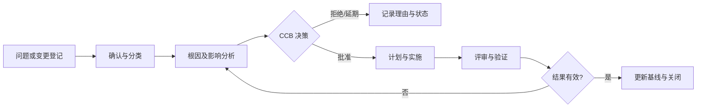

# 变更与问题管理过程

> 文档编号：MEES-PRO-007
> 版本：v0.2.0
> 状态：已批准
> 所有者：变更控制负责人
> 最后更新：2026-07-14

## 1. 目的

定义问题登记、分析、处置以及基线变更申请、影响分析、决策、实施和验证闭环，确保任何变更都有来源、责任、批准、实现版本和验证结论。

## 2. 适用范围

适用于需求、设计、实现、测试、工具、配置、发布和现场问题引起的变更。纯编辑修正可按裁剪规则简化，但不得改变已批准内容的技术含义。

## 3. 流程位置

本过程横向连接全部核心过程。问题记录用于描述偏差或故障，变更申请用于控制对受控基线的修改；配置管理负责保存版本和基线，本过程负责变更决策及闭环逻辑。

## 4. 输入

| 输入 | 来源 |
|---|---|
| 评审发现、测试缺陷、现场问题 | 工程、测试、质量、客户 |
| 需求或范围调整 | 产品、项目、客户 |
| 风险、安全或网络安全发现 | 风险与领域工程 |
| 基线、配置项和发布状态 | 配置管理 |

## 5. 活动

1. 登记问题或变更，分配唯一标识、类型、严重度、优先级和责任人。
2. 复现或确认问题，分析根因、影响范围和临时控制措施。
3. 对变更分析范围、进度、成本、需求、设计、实现、测试、配置、发布和合规影响。
4. 由变更控制委员会决定批准、拒绝、延期或要求补充分析。
5. 将已批准变更纳入计划并关联受影响工作产品、提交、构建和测试。
6. 执行修复或变更，完成评审、回归验证和配置状态更新。
7. 确认结果有效且无不可接受副作用后关闭，并将系统性问题输入复盘和改进。

## 6. 输出与工作产品

| 工作产品 | 最小要求 |
|---|---|
| 问题记录 | 现象、环境、严重度、复现信息、影响和责任人 |
| 根因与影响分析 | 技术根因、受影响工作产品、风险和建议措施 |
| 变更申请 | 原因、范围、方案、成本进度影响和验证要求 |
| CCB 决策记录 | 决策、条件、批准人、目标版本和优先级 |
| 实施与验证记录 | 提交/制品、评审、测试结果、回归范围和版本 |
| 关闭记录 | 关闭依据、遗留风险、通知对象和经验反馈 |

## 7. 角色与职责

| 角色 | 职责 |
|---|---|
| 提交人 | 提供完整问题或变更背景及期望结果 |
| 问题负责人 | 组织复现、根因分析、处置和关闭 |
| 变更控制负责人 | 组织影响分析和 CCB 决策，维护变更状态 |
| 工程负责人 | 评估技术影响并对实施方案负责 |
| 测试负责人 | 定义验证和回归范围，确认测试结论 |
| 配置管理员 | 维护受影响配置项、基线和实施版本关系 |
| 质量负责人 | 监督决策证据、风险接受和关闭完整性 |

## 8. 流程图

## 9. 评审与批准

- 严重或影响基线的变更必须由产品/项目、工程、测试、配置和质量代表评审。
- 安全、网络安全、法规、客户承诺或量产影响必须由对应责任人批准。
- 关闭前必须确认实施版本、验证结果、追溯关系和相关方通知完整。

## 10. 配置与变更控制

问题、变更、分析、决策、实施和验证记录均应受控。每个已批准变更必须追溯到受影响基线和首次包含该变更的版本；发布后修复必须形成新的版本或补丁标识。

## 11. 度量指标

| 指标 | 数据来源 |
|---|---|
| 问题平均关闭周期 | 问题台账 |
| 变更按期完成率 | 变更计划 / 状态记录 |
| 变更返工率 | 验证和重新打开记录 |
| 高严重度开放问题数 | 问题台账 |
| 变更追溯完整率 | 变更记录 / 配置状态报告 |

## 12. 裁剪规则

- 未改变技术含义的文字、排版和链接修正可简化 CCB，但须保留评审和版本记录。
- 紧急修复可先执行快速决策，但必须记录风险接受人，并在发布后补齐完整分析和关闭证据。
- 安全、网络安全、量产和客户交付变更不得裁剪影响分析、回归验证和配置更新。

## 13. 实施证据

- 问题与变更台账。
- 根因分析、影响分析和 CCB 决策。
- 实施提交、代码评审、构建和测试记录。
- 基线更新、发布版本和关闭批准记录。

## 14. 标准映射

| 标准或方法 | 映射说明 |
|---|---|
| ASPICE | SUP.9 问题解决管理、SUP.10 变更请求管理 |
| ISO/IEC 33020 | PA1.1 过程执行、PA2.1 执行管理、PA2.2 工作产品管理 |
| ISO 9001 | 不合格输出控制、纠正措施和变更控制接口 |

## 15. 版本历史

| 版本 | 日期 | 修改人 | 修改说明 |
|---|---|---|---|
| v0.2.0 | 2026-07-14 | JianShi | 初始版本 |
