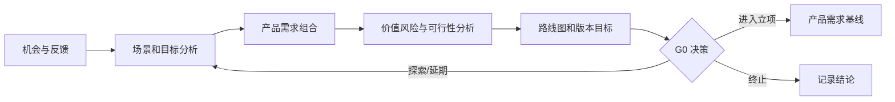

# 产品规划过程

> 文档编号：MEES-PRO-101
> 版本：v0.2.0
> 状态：已批准
> 所有者：产品负责人
> 最后更新：2026-07-14

## 1. 目的

定义产品机会识别、目标形成、需求组合、路线图和候选版本决策的方法，为项目立项、系统工程和发布规划提供稳定的业务输入。

## 2. 适用范围

适用于新产品、产品平台、客户定制、重大功能、量产演进和产品退市规划。单一缺陷修复可直接进入变更与问题管理过程。

## 3. 流程位置

产品规划是 MEES 生命周期入口，接收市场、客户、战略和现场反馈，向项目管理提供立项目标，向需求管理和系统工程提供产品需求基线，并接收发布和项目复盘反馈。

## 4. 输入

| 输入 | 来源 |
|---|---|
| 市场机会、用户场景、竞品信息 | 市场 / 产品 |
| 客户需求、合同机会、现场反馈 | 客户 / 销售 / 服务 |
| 组织战略、平台能力和资源边界 | 管理层 / 工程 |
| 法规、安全、网络安全和质量约束 | 合规 / 领域工程 |
| 发布表现、缺陷趋势和经验教训 | 发布 / 项目 / 质量 |

## 5. 活动

1. 登记产品机会和需求来源，识别目标用户、使用场景和业务问题。
2. 定义产品目标、成功指标、范围边界和关键约束。
3. 分析价值、成本、风险、技术可行性、合规影响和复用机会。
4. 建立产品需求并按价值、风险、依赖和时效排序。
5. 规划产品路线图、候选版本、最小可行范围和退出条件。
6. 执行 G0 产品机会评审，决定进入立项、继续探索、延期或终止。
7. 根据交付结果、客户反馈和度量数据持续调整路线图。

## 6. 输出与工作产品

| 工作产品 | 最小要求 |
|---|---|
| 产品愿景与目标 | 目标用户、价值主张、范围、成功指标和约束 |
| 产品需求清单 | 标识、来源、场景、价值、优先级、验收意图和状态 |
| 产品路线图 | 时间窗口、候选版本、主题、依赖和决策点 |
| 商业与可行性分析 | 收益假设、成本、风险、技术和合规结论 |
| 版本目标 | 目标、候选范围、质量目标和市场/客户承诺 |
| G0 决策记录 | 决策、理由、条件、批准人和后续行动 |

## 7. 角色与职责

| 角色 | 职责 |
|---|---|
| 产品负责人 | 对产品目标、优先级、路线图和 G0 材料负责 |
| 市场 / 客户代表 | 提供需求来源、场景、价值和承诺信息 |
| 系统负责人 | 评估技术可行性、平台复用和关键风险 |
| 项目经理 | 评估资源、周期、依赖和交付可行性 |
| 质量及领域负责人 | 评估质量、法规、安全和网络安全约束 |
| 管理代表 | 对重大产品机会和资源承诺作最终决策 |

## 8. 流程图

## 9. 评审与批准

- G0 应检查价值、目标用户、范围、成功指标、关键风险、合规约束和资源假设。
- 产品需求基线由产品负责人组织，系统、项目、质量及相关领域负责人参与评审。
- 客户承诺、量产节点和高风险功能必须有管理代表批准。

## 10. 配置与变更控制

产品目标、需求清单、路线图、版本目标和 G0 记录应纳入版本控制。产品需求基线后发生的优先级或范围变化应进入变更管理并分析项目、系统、验证和发布影响。

## 11. 度量指标

| 指标 | 数据来源 |
|---|---|
| 产品目标达成率 | 版本目标 / 发布复盘 |
| 路线图变更率 | 路线图版本历史 |
| 产品需求进入率 | 产品需求台账 |
| 客户需求覆盖率 | 需求追溯记录 |
| 机会决策周期 | G0 决策记录 |

## 12. 裁剪规则

- 内部探索可使用一页式产品说明，但必须保留目标用户、问题、成功准则、风险和决策。
- 客户交付、量产或合规相关产品不得裁剪需求来源、版本目标和 G0 评审。

## 13. 实施证据

- 产品愿景、目标和成功指标。
- 产品需求清单及来源记录。
- 产品路线图和版本目标。
- 可行性分析、G0 结论和行动项关闭记录。
- 发布反馈进入路线图的决策记录。

## 14. 标准映射

| 标准或方法 | 映射说明 |
|---|---|
| Agile | 产品待办、价值排序、增量版本和反馈闭环 |
| ASPICE | 为 MAN.3、SYS.2 和 SPL.2 提供范围及版本输入，不等同于单一 ASPICE 过程 |
| ISO/IEC 33020 | PA1.1 过程执行、PA2.1 执行管理、PA2.2 工作产品管理 |
| ISO 9001 | 顾客需求、策划、设计开发输入和绩效反馈接口 |

## 15. 版本历史

| 版本 | 日期 | 修改人 | 修改说明 |
|---|---|---|---|
| v0.2.0 | 2026-07-14 | JianShi | 初始版本 |
