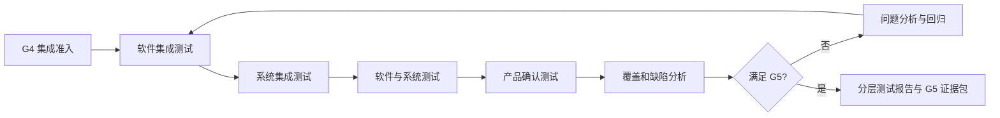

# 集成与测试过程

> 文档编号：MEES-PRO-501
> 版本：v0.2.0
> 状态：评审中
> 所有者：测试负责人
> 最后更新：2026-07-14

## 1. 目的

定义软件集成、系统集成、软件测试、系统测试和产品确认的分层执行活动，产生受控测试证据包，供验证确认过程汇总覆盖、形成 G5 结论和发布验证建议。

## 2. 适用范围

适用于软件组件集成、软硬件集成、系统集成、软件测试、系统测试、确认测试、回归测试和发布候选验证。单元验证由软件工程过程负责。

## 3. 流程位置

本过程承接软件增量、系统架构、需求基线和总体验证策略，负责分层测试计划、规格、执行记录、缺陷记录和分层报告，向验证确认总控过程提供 G5 证据包。本过程不拥有跨层 G5 最终结论或发布验证建议。

## 4. 输入

| 输入 | 来源 |
|---|---|
| 软件基线、单元结果、集成说明 | 软件工程 |
| 系统需求、系统架构、接口和集成策略 | 系统工程 |
| 产品需求、验收准则和发布目标 | 产品 / 需求 / 项目管理 |
| 测试环境、配置、工具和构建包 | 配置管理 / DevOps |
| 历史缺陷、变更和风险 | 变更与问题管理 / 质量 |

## 5. 活动

1. 建立分层测试计划，定义软件集成、系统集成、软件测试、系统测试和确认测试范围。
2. 根据需求、架构、接口、风险和历史问题设计测试项、用例、数据和覆盖目标。
3. 确认 G4 准入，建立测试环境、配置基线和可复现的测试对象。
4. 按既定顺序执行软件和系统集成，验证接口、交互、时序、资源和异常行为。
5. 执行软件、系统和确认测试，记录版本、环境、结果、日志和偏差。
6. 登记并推动缺陷分析、修复、回归和关闭，持续维护双向追溯。
7. 分析覆盖率、通过率、缺陷、偏差和遗留风险，形成 G5 分层测试证据包并提交验证确认过程。

## 6. 输出与工作产品

| 工作产品 | 最小要求 |
|---|---|
| 分层测试计划 | 层级、范围、环境、顺序、资源、准入准出和进度 |
| 测试规格 / 用例 | 目标、追溯、前置条件、步骤、数据和预期结果 |
| 环境与配置记录 | 硬件、软件、工具、数据、版本和校准信息 |
| 集成与测试执行记录 | 对象版本、执行人、时间、结果、日志和偏差 |
| 缺陷与回归记录 | 严重度、复现、分析、修复版本、回归和关闭 |
| 分层测试报告 | 覆盖、通过率、缺陷、偏差、风险和层级结论 |
| G5 分层测试证据包 | 分层报告索引、覆盖、缺陷、偏差、遗留风险和建议结论；作为 G5 输入 |

## 7. 角色与职责

| 角色 | 职责 |
|---|---|
| 测试负责人 | 对分层测试计划、测试证据完整性和 G5 证据包最终负责 |
| 集成工程师 | 对集成顺序、环境、接口验证和集成问题负责 |
| 测试工程师 | 设计、执行、记录和维护测试及追溯 |
| 系统 / 软件负责人 | 支持技术分析并确认测试充分性和遗留风险 |
| 开发工程师 | 分析修复缺陷并提供受控软件增量 |
| 配置管理员 | 维护测试对象、环境、数据、结果和报告基线 |
| 质量负责人 | 检查独立性、覆盖、缺陷闭环和准出证据 |

## 8. 流程图

## 9. 评审与批准

- 测试计划由测试负责人组织，系统、软件、项目、配置和质量代表评审。
- 测试用例必须覆盖适用需求、接口、边界、异常、回归、风险及安全/网络安全场景。
- 提交 G5 证据包前，计划内测试应完成、覆盖目标应满足、阻塞缺陷应清零，其他遗留项应有风险分析和建议处置；G5 最终结论由验证确认过程形成。

## 10. 配置与变更控制

测试计划、规格、脚本、数据、环境、执行记录、日志和报告均应受控。输入基线变化必须触发测试影响分析；重新执行必须保留原结果并关联新版本和变更原因。

## 11. 度量指标

| 指标 | 数据来源 |
|---|---|
| 需求测试覆盖率 | 追溯矩阵 |
| 分层测试通过率 | 测试执行记录 |
| 缺陷发现/关闭趋势 | 问题台账 |
| 缺陷逃逸率 | 下游测试 / 现场问题 |
| 回归完成率 | 回归计划 / 结果 |
| 测试环境可用率 | 环境运行记录 |

## 12. 裁剪规则

- 低风险内部原型可合并软件和系统测试报告，但必须保留测试对象、环境、关键验收结果和已知风险。
- 无硬件产品可裁剪软硬件集成活动，但需说明不适用理由。
- 客户交付、量产、安全或网络安全相关版本不得裁剪需求覆盖、配置记录、缺陷闭环和 G5 分层测试证据包。

## 13. 实施证据

- 分层测试计划、测试规格和评审记录。
- 测试环境/对象基线和 G4 准入记录。
- 集成与测试结果、日志、缺陷和回归证据。
- 追溯/覆盖报告、分层测试报告和 G5 分层测试证据包。

## 14. 标准映射

| 标准或方法 | 映射说明 |
|---|---|
| ASPICE | SWE.5 软件集成与集成测试、SWE.6 软件测试、SYS.4 系统集成与集成测试、SYS.5 系统测试 |
| ISO/IEC 33020 | PA1.1 过程执行、PA2.1 执行管理、PA2.2 工作产品管理、PA3.2 过程部署接口 |
| ISO 26262 | 软件、系统和安全确认相关验证证据接口 |
| IEC 62443 | 安全功能、接口、负向场景和漏洞验证接口 |

## 15. 版本历史

| 版本 | 日期 | 修改人 | 修改说明 |
|---|---|---|---|
| v0.2.0 | 2026-07-14 | JianShi | 初始版本；明确分层执行证据与 G5 总控结论边界 |
