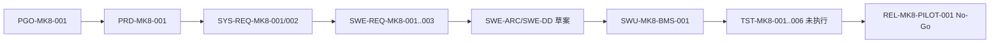

# MK8 RSIIC V1 v0.4 模板走查

## 1. 目的与证据边界

验证 v0.4 规范模板能否被复制到真实 BMS 代码背景下，形成有边界、可追溯、能阻止错误发布的最小记录。试点使用本地源码提交 `7e1d573` 的可观察事实作为 `P` 候选输入，需求、角色、门禁和测试均为模拟 `S`。

本走查评价模板可用性，不评价 MK8 产品是否通过 G0–G6，也不形成安全、网络安全、量产或发布结论。

## 2. 复制结果

实例位于 `examples/mk8-rsiic-v1-v04-pilot/`。

| 模板 | 实例对象 | 走查结果 |
|---|---|---|
| `TPL-V04-001` | 项目裁剪与综合计划 | 能区分 V4-G0 与产品 G0，暴露真实角色和产品边界缺口 |
| `TPL-V04-002` | 源码基线封面 | 能记录提交、配置项和未完成配置审计 |
| `TPL-V04-003` | 需求与追溯 | 能形成模拟 PGO→PRD→SYS-REQ→SWE-REQ 链，保持系统/软件责任分离 |
| `TPL-V04-004` | 架构与接口 | 能从实现恢复元素/接口草案，并标记未批准与桩函数限制 |
| `TPL-V04-005` | 验证计划/报告 | 能规划 6 项测试并明确 0/6 未执行，拒绝形成 G5 建议 |
| `TPL-V04-006` | 发布决定 | 在构建、测试、审计和回退缺失时形成 `No-Go` |
| `TPL-V04-007` | QA 与不符合项 | 识别 3 项主要项目证据缺口和非独立性限制 |
| `TPL-V04-012` | SBOM/供应方证据 | 能盘点 8 类组件并暴露版本、许可和漏洞监控缺口 |
| `TPL-V04-013` | `EXT-HW` 协议 | 能把 AFE、接触器、IMD、SBC 从软件实现分配到外部证据合同 |

## 3. 模拟端到端链路

正向链路能够生成稳定标识；反向从 `REL` 可查询测试、实现种子、设计、需求和产品目标。由于测试未执行、实现未变更，链路终点必须是 `No-Go`。

## 4. V4 门禁走查

| 门禁 | 模板建设结论 | 依据 |
|---|---|---|
| V4-G0 | 通过 | JianShi 已批准 18 项范围、工作包和试点策略 |
| V4-G1 | 通过（候选规则） | 元数据、占位符、复制、裁剪、责任和归档规则统一 |
| V4-G2 | 通过（模板候选） | 核心治理、需求、架构、验证和发布模板均可复制 |
| V4-G3 | 通过（模板候选） | 功能安全、网络安全、供应方和 `EXT-HW` 模板完整且边界明确 |
| V4-G4 | 通过（模板可用性） | 9 项必须实例完成，自动检查通过，发布模板正确给出 `No-Go` |
| 产品 G0–G6 | 不通过/未执行 | 真实产品输入、角色、实现、构建、测试和批准缺失 |

## 5. 发现与反馈

| 编号 | 类型 | 发现 | 处置 |
|---|---|---|---|
| F1 | 一般 | 系统/软件共用模板必须在复制时选择单一层级和最终责任 | 已在模板使用说明和实例中明确，不合并批准 |
| F2 | 一般 | 真实产品安全/网络安全适用性尚未确定 | 保持 HARA/TARA 实例为“按适用性”，不宣称项目证据 |
| F3 | 一般 | 组件精确版本、许可、漏洞状态和工具链不完整 | SBOM 实例保留开放项，进入真实 G1/G4 前关闭 |
| F4 | 一般 | 9 项实例能验证主体链路，但 P1 模板尚无项目实例 | P1 已完成结构检查，后续真实项目按触发条件使用 |

模板层开放严重问题为 0，主要问题为 0。项目层 3 项主要证据缺口保留在 QA 实例中，不影响 M4 模板可复制结论，但阻断 MK8 产品发布。

## 6. 结论

**V4-G4 模板可用性走查通过。** 18 项规范模板和 9 项必须实例具备统一元数据、唯一责任、裁剪、追溯、评审和证据边界；MK8 产品项目仍为 `No-Go`，等待真实输入与执行。

关联资料：

- [v0.4 工程模板建设计划](../00_Introduction/05_v0.4工程模板建设计划.md)
- [v0.4 模板目录与使用规则](../13_Templates/v0.4模板目录与使用规则.md)
- [MK8 项目试点](MK8_RSIIC_V1项目试点.md)
- [MK8 证据台账](MK8_RSIIC_V1证据台账.md)
